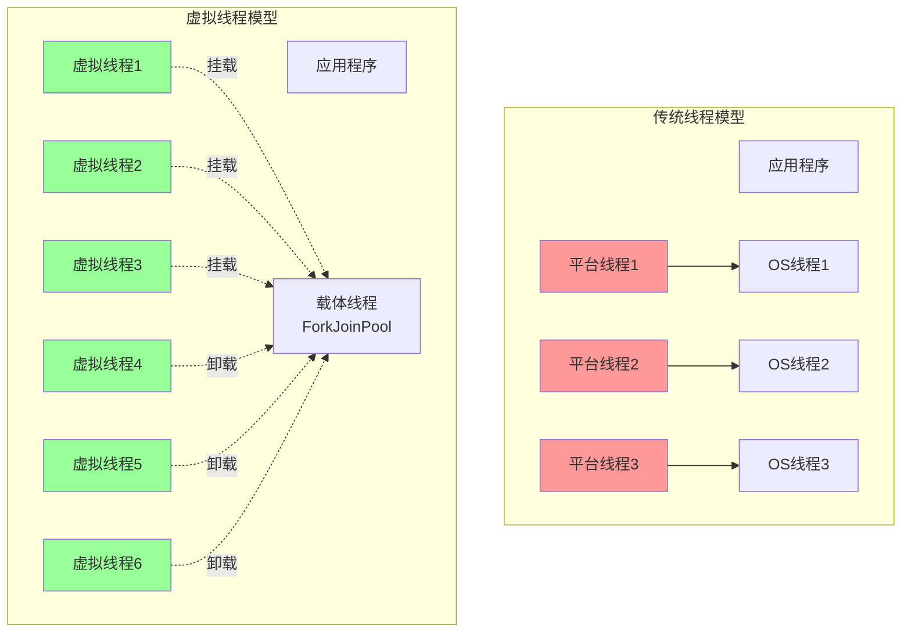

# 虚拟线程实战（Java 21）

> **学习目标**:掌握Java 21虚拟线程的使用和最佳实践
> **核心内容**:虚拟线程原理、与传统线程对比、Spring Boot集成、高并发应用
> **预计时间**:10小时

## 虚拟线程概述

### 什么是虚拟线程

```java
/**
 * 虚拟线程介绍
 */
public class VirtualThreadsIntroduction {

    /*
    虚拟线程(Virtual Threads)是Java 19预览、Java 21正式发布的特性。

    核心概念:
    1. 虚拟线程是JDK提供的轻量级线程
    2. 由JVM管理,不与操作系统线程一对一绑定
    3. 适合IO密集型任务
    4. 可以创建数百万个虚拟线程

    对比传统线程:
    - 平台线程(Platform Thread):映射到OS线程,重量级,数量有限
    - 虚拟线程(Virtual Thread):轻量级,数量几乎无限,由JVM调度
    */

    public static void main(String[] args) {
        System.out.println("=== 虚拟线程 vs 平台线程 ===\n");

        System.out.println("平台线程特点:");
        System.out.println("  - 与OS线程1:1映射");
        System.out.println("  - 创建成本高");
        System.out.println("  - 内存占用大(~1MB/线程)");
        System.out.println("  - 数量受限(几千个)");
        System.out.println("  - 阻塞时占用OS线程\n");

        System.out.println("虚拟线程特点:");
        System.out.println("  - JVM管理的轻量级线程");
        System.out.println("  - 创建成本低");
        System.out.println("  - 内存占用小(~几KB/线程)");
        System.out.println("  - 数量几乎无限(百万级)");
        System.out.println("  - 阻塞时不占用OS线程");
        System.out.println("  - 适合IO密集型任务\n");
    }
}
```

### 虚拟线程工作原理



## 虚拟线程基础

### 创建虚拟线程

```java
package com.example.virtualthreads;

import java.util.concurrent.Executors;

/**
 * 虚拟线程创建方式
 */
public class CreatingVirtualThreads {

    /**
     * 方式1: 使用Thread.ofVirtual()创建
     */
    public static void createVirtualThread1() {
        Thread vThread = Thread.ofVirtual()
                .name("virtual-thread-1")
                .start(() -> {
                    System.out.println("虚拟线程运行: " + Thread.currentThread());
                    System.out.println("是否为虚拟线程: " + Thread.currentThread().isVirtual());
                });

        // 等待线程完成
        vThread.join();
    }

    /**
     * 方式2: 使用Thread.startVirtualThread()创建
     */
    public static void createVirtualThread2() {
        Thread vThread = Thread.startVirtualThread(() -> {
            System.out.println("快速创建虚拟线程: " + Thread.currentThread());
        });

        vThread.join();
    }

    /**
     * 方式3: 使用虚拟线程执行器
     */
    public static void createVirtualThread3() {
        try (var executor = Executors.newVirtualThreadPerTaskExecutor()) {
            for (int i = 0; i < 10; i++) {
                final int taskId = i;
                executor.submit(() -> {
                    System.out.println("任务 " + taskId + " 执行中: " + Thread.currentThread());
                    try {
                        Thread.sleep(1000);
                    } catch (InterruptedException e) {
                        Thread.currentThread().interrupt();
                    }
                    System.out.println("任务 " + taskId + " 完成");
                });
            }
        }
    }

    /**
     * 方式4: 批量创建虚拟线程
     */
    public static void createBulkVirtualThreads() {
        try (var executor = Executors.newVirtualThreadPerTaskExecutor()) {
            // 创建10万个虚拟线程
            for (int i = 0; i < 100_000; i++) {
                final int taskId = i;
                executor.submit(() -> {
                    // 模拟IO操作
                    try {
                        Thread.sleep(1000);
                    } catch (InterruptedException e) {
                        Thread.currentThread().interrupt();
                    }
                });
            }
            System.out.println("已提交10万个虚拟线程任务");
        }
    }

    public static void main(String[] args) throws Exception {
        System.out.println("1. 使用Thread.ofVirtual()创建:");
        createVirtualThread1();

        System.out.println("\n2. 使用Thread.startVirtualThread()创建:");
        createVirtualThread2();

        System.out.println("\n3. 使用虚拟线程执行器:");
        createVirtualThread3();

        System.out.println("\n4. 批量创建虚拟线程:");
        // createBulkVirtualThreads(); // 取消注释以测试大量虚拟线程
    }
}
```

### 虚拟线程vs平台线程性能对比

```java
package com.example.virtualthreads;

import java.util.concurrent.Executors;
import java.util.concurrent.TimeUnit;
import java.util.concurrent.atomic.AtomicInteger;

/**
 * 性能对比测试
 */
public class PerformanceComparison {

    /**
     * 测试平台线程性能
     */
    public static void testPlatformThreads(int threadCount) throws InterruptedException {
        long startTime = System.currentTimeMillis();
        AtomicInteger completed = new AtomicInteger(0);

        try (var executor = Executors.newFixedThreadPool(200)) {
            for (int i = 0; i < threadCount; i++) {
                executor.submit(() -> {
                    try {
                        // 模拟IO操作
                        Thread.sleep(1000);
                        completed.incrementAndGet();
                    } catch (InterruptedException e) {
                        Thread.currentThread().interrupt();
                    }
                });
            }
        }

        long duration = System.currentTimeMillis() - startTime;
        System.out.printf("平台线程: %d个任务, 耗时: %dms, 完成: %d%n",
                threadCount, duration, completed.get());
    }

    /**
     * 测试虚拟线程性能
     */
    public static void testVirtualThreads(int threadCount) throws InterruptedException {
        long startTime = System.currentTimeMillis();
        AtomicInteger completed = new AtomicInteger(0);

        try (var executor = Executors.newVirtualThreadPerTaskExecutor()) {
            for (int i = 0; i < threadCount; i++) {
                executor.submit(() -> {
                    try {
                        // 模拟IO操作
                        Thread.sleep(1000);
                        completed.incrementAndGet();
                    } catch (InterruptedException e) {
                        Thread.currentThread().interrupt();
                    }
                });
            }
        }

        long duration = System.currentTimeMillis() - startTime;
        System.out.printf("虚拟线程: %d个任务, 耗时: %dms, 完成: %d%n",
                threadCount, duration, completed.get());
    }

    public static void main(String[] args) throws InterruptedException {
        System.out.println("=== 性能对比测试 ===\n");
        System.out.println("测试场景: 10万并发任务, 每个任务休眠1秒\n");

        // 测试平台线程
        System.out.println("测试平台线程(线程池大小200):");
        testPlatformThreads(100_000);

        Thread.sleep(2000);

        // 测试虚拟线程
        System.out.println("\n测试虚拟线程:");
        testVirtualThreads(100_000);

        /*
        预期结果:
        - 平台线程: 受限于线程池大小,需要分批执行,耗时较长
        - 虚拟线程: 可以并发执行所有任务,大幅缩短耗时
        */
    }
}
```

## 虚拟线程与synchronized

### synchronized在虚拟线程中的行为

```java
package com.example.virtualthreads;

import java.util.concurrent.Executors;

/**
 * synchronized与虚拟线程
 */
public class SynchronizedWithVirtualThreads {

    private static final Object lock = new Object();
    private static int counter = 0;

    /**
     * 虚拟线程中使用synchronized
     * 注意: 在synchronized块中阻塞会pin载体线程
     */
    public static void testSynchronized() throws InterruptedException {
        try (var executor = Executors.newVirtualThreadPerTaskExecutor()) {
            for (int i = 0; i < 1000; i++) {
                executor.submit(() -> {
                    synchronized (lock) {
                        counter++;
                        try {
                            // 注意: 在synchronized块中休眠会pin载体线程
                            // 这会降低虚拟线程的性能优势
                            Thread.sleep(100);
                        } catch (InterruptedException e) {
                            Thread.currentThread().interrupt();
                        }
                    }
                });
            }
        }
        System.out.println("Counter: " + counter);
    }

    /**
     * 改进方案: 使用ReentrantLock替代synchronized
     */
    public static void testReentrantLock() throws InterruptedException {
        java.util.concurrent.locks.ReentrantLock lock = new java.util.concurrent.locks.ReentrantLock();
        int counter = 0;

        try (var executor = Executors.newVirtualThreadPerTaskExecutor()) {
            for (int i = 0; i < 1000; i++) {
                final int index = i;
                executor.submit(() -> {
                    lock.lock();
                    try {
                        counter++;
                        Thread.sleep(100);
                    } catch (InterruptedException e) {
                        Thread.currentThread().interrupt();
                    } finally {
                        lock.unlock();
                    }
                });
            }
        }
        System.out.println("Counter with ReentrantLock: " + counter);
    }

    public static void main(String[] args) throws InterruptedException {
        System.out.println("1. 使用synchronized:");
        long start = System.currentTimeMillis();
        testSynchronized();
        System.out.println("耗时: " + (System.currentTimeMillis() - start) + "ms");

        System.out.println("\n2. 使用ReentrantLock:");
        start = System.currentTimeMillis();
        testReentrantLock();
        System.out.println("耗时: " + (System.currentTimeMillis() - start) + "ms");
    }
}
```

## Spring Boot 3.2虚拟线程集成

### 启用虚拟线程支持

```java
package com.example.virtualthreads.config;

import org.springframework.context.annotation.Bean;
import org.springframework.context.annotation.Configuration;
import org.springframework.core.task.AsyncTaskExecutor;
import org.springframework.core.task.support.TaskExecutorAdapter;
import org.springframework.scheduling.annotation.EnableAsync;
import org.springframework.web.servlet.config.annotation.AsyncSupportConfigurer;
import org.springframework.web.servlet.config.annotation.WebMvcConfigurer;

import java.util.concurrent.Executors;

/**
 * Spring Boot虚拟线程配置
 */
@Configuration
@EnableAsync
public class VirtualThreadConfig implements WebMvcConfigurer {

    /**
     * 配置异步任务执行器为虚拟线程
     */
    @Bean(name = "virtualThreadTaskExecutor")
    public AsyncTaskExecutor virtualThreadTaskExecutor() {
        return new TaskExecutorAdapter(Executors.newVirtualThreadPerTaskExecutor());
    }

    /**
     * 配置Spring MVC异步支持使用虚拟线程
     */
    @Override
    public void configureAsyncSupport(AsyncSupportConfigurer configurer) {
        configurer.setTaskExecutor(new TaskExecutorAdapter(
                Executors.newVirtualThreadPerTaskExecutor()
        ));
        configurer.setDefaultTimeout(30000);
    }
}
```

### 虚拟线程Controller示例

```java
package com.example.virtualthreads.controller;

import com.example.virtualthreads.service.UserService;
import org.springframework.beans.factory.annotation.Autowired;
import org.springframework.scheduling.annotation.Async;
import org.springframework.web.bind.annotation.*;
import org.springframework.web.client.RestTemplate;

import java.util.concurrent.CompletableFuture;

/**
 * 虚拟线程Controller
 */
@RestController
@RequestMapping("/api/users")
public class UserController {

    @Autowired
    private UserService userService;

    @Autowired
    private RestTemplate restTemplate;

    /**
     * 同步方式(使用虚拟线程处理)
     */
    @GetMapping("/{id}")
    public String getUser(@PathVariable Long id) {
        // Spring Boot 3.2会自动使用虚拟线程处理请求
        // 可以直接进行阻塞IO操作
        return userService.findById(id);
    }

    /**
     * 异步方式(使用虚拟线程)
     */
    @GetMapping("/async/{id}")
    public CompletableFuture<String> getUserAsync(@PathVariable Long id) {
        return CompletableFuture.supplyAsync(() -> {
            return userService.findById(id);
        }, Executors.newVirtualThreadPerTaskExecutor());
    }

    /**
     * 调用外部服务
     */
    @GetMapping("/external/{id}")
    public String getExternalUser(@PathVariable Long id) {
        // 虚拟线程可以安全地进行阻塞调用
        String url = "https://api.example.com/users/" + id;
        return restTemplate.getForObject(url, String.class);
    }

    /**
     * 批量并发请求
     */
    @GetMapping("/batch")
    public String batchGetUsers(@RequestParam Long[] ids) {
        try (var executor = Executors.newVirtualThreadPerTaskExecutor()) {
            var futures = ids.entrySet().stream()
                    .map(id -> CompletableFuture.supplyAsync(
                            () -> userService.findById(id),
                            executor
                    ))
                    .toList();

            // 等待所有请求完成
            CompletableFuture.allOf(futures.toArray(new CompletableFuture[0])).join();

            return futures.stream()
                    .map(CompletableFuture::join)
                    .toList()
                    .toString();
        }
    }
}
```

### 虚拟线程Service示例

```java
package com.example.virtualthreads.service;

import org.springframework.scheduling.annotation.Async;
import org.springframework.stereotype.Service;

import java.util.concurrent.CompletableFuture;
import java.util.concurrent.Executors;

/**
 * 虚拟线程Service
 */
@Service
public class UserService {

    /**
     * 同步查询(使用虚拟线程)
     */
    public String findById(Long id) {
        // 模拟数据库查询
        try {
            Thread.sleep(100); // 阻塞IO
        } catch (InterruptedException e) {
            Thread.currentThread().interrupt();
        }
        return "User-" + id;
    }

    /**
     * 异步查询
     */
    @Async
    public CompletableFuture<String> findByIdAsync(Long id) {
        return CompletableFuture.completedFuture(findById(id));
    }

    /**
     * 批量并发查询
     */
    public String batchFindByIds(Long[] ids) {
        try (var executor = Executors.newVirtualThreadPerTaskExecutor()) {
            var results = ids.entrySet().stream()
                    .map(id -> CompletableFuture.supplyAsync(
                            () -> findById(id),
                            executor
                    ))
                    .map(CompletableFuture::join)
                    .toList();

            return results.toString();
        }
    }
}
```

### application.yml配置

```yaml
# application.yml
spring:
  mvc:
    async:
      request-timeout: 30000  # 异步请求超时时间

  threads:
    virtual:
      enabled: true  # 启用虚拟线程( Spring Boot 3.2+)

server:
  tomcat:
    threads:
      max: 200  # 减少Tomcat线程数,因为使用虚拟线程
    accept-count: 100

# 日志配置
logging:
  level:
    com.example.virtualthreads: DEBUG
```

## 实战案例:高并发IO应用

### HTTP客户端示例

```java
package com.example.virtualthreads.http;

import java.net.URI;
import java.net.http.HttpClient;
import java.net.http.HttpRequest;
import java.net.http.HttpResponse;
import java.time.Duration;
import java.util.concurrent.Executors;

/**
 * 虚拟线程HTTP客户端
 */
public class VirtualThreadHttpClient {

    private final HttpClient httpClient;

    public VirtualThreadHttpClient() {
        this.httpClient = HttpClient.newBuilder()
                .version(HttpClient.Version.HTTP_2)
                .connectTimeout(Duration.ofSeconds(10))
                .build();
    }

    /**
     * 发起HTTP GET请求
     */
    public String get(String url) throws Exception {
        HttpRequest request = HttpRequest.newBuilder()
                .uri(URI.create(url))
                .GET()
                .build();

        HttpResponse<String> response = httpClient.send(
                request,
                HttpResponse.BodyHandlers.ofString()
        );

        return response.body();
    }

    /**
     * 并发请求多个URL
     */
    public void concurrentRequests(String[] urls) {
        try (var executor = Executors.newVirtualThreadPerTaskExecutor()) {
            for (String url : urls) {
                executor.submit(() -> {
                    try {
                        String response = get(url);
                        System.out.println("URL: " + url + ", 长度: " + response.length());
                    } catch (Exception e) {
                        System.err.println("请求失败: " + url + ", " + e.getMessage());
                    }
                });
            }
        }
    }

    /**
     * 性能测试
     */
    public static void main(String[] args) {
        var client = new VirtualThreadHttpClient();

        // 准备测试URL
        String[] urls = new String[1000];
        for (int i = 0; i < urls.length; i++) {
            urls[i] = "https://api.example.com/data/" + i;
        }

        System.out.println("开始并发请求...");
        long start = System.currentTimeMillis();

        client.concurrentRequests(urls);

        System.out.println("总耗时: " + (System.currentTimeMillis() - start) + "ms");
    }
}
```

### 数据库连接池示例

```java
package com.example.virtualthreads.database;

import com.zaxxer.hikari.HikariConfig;
import com.zaxxer.hikari.HikariDataSource;

import java.sql.Connection;
import java.sql.PreparedStatement;
import java.sql.ResultSet;
import java.util.concurrent.Executors;

/**
 * 虚拟线程数据库操作
 */
public class VirtualThreadDatabase {

    private final HikariDataSource dataSource;

    public VirtualThreadDatabase() {
        HikariConfig config = new HikariConfig();
        config.setJdbcUrl("jdbc:mysql://localhost:3306/test");
        config.setUsername("root");
        config.setPassword("root");
        config.setMaximumPoolSize(10);  // 连接池大小

        this.dataSource = new HikariDataSource(config);
    }

    /**
     * 查询用户
     */
    public User findById(Long id) throws Exception {
        try (Connection conn = dataSource.getConnection();
             PreparedStatement ps = conn.prepareStatement(
                     "SELECT * FROM users WHERE id = ?")) {

            ps.setLong(1, id);

            try (ResultSet rs = ps.executeQuery()) {
                if (rs.next()) {
                    User user = new User();
                    user.setId(rs.getLong("id"));
                    user.setName(rs.getString("name"));
                    user.setEmail(rs.getString("email"));
                    return user;
                }
            }
        }
        return null;
    }

    /**
     * 批量并发查询
     */
    public void batchQuery(Long[] ids) {
        try (var executor = Executors.newVirtualThreadPerTaskExecutor()) {
            for (Long id : ids) {
                executor.submit(() -> {
                    try {
                        User user = findById(id);
                        System.out.println("查询到用户: " + user);
                    } catch (Exception e) {
                        System.err.println("查询失败: " + id);
                    }
                });
            }
        }
    }

    public static class User {
        private Long id;
        private String name;
        private String email;

        // getters and setters
        public Long getId() { return id; }
        public void setId(Long id) { this.id = id; }
        public String getName() { return name; }
        public void setName(String name) { this.name = name; }
        public String getEmail() { return email; }
        public void setEmail(String email) { this.email = email; }

        @Override
        public String toString() {
            return "User{id=" + id + ", name='" + name + "', email='" + email + "'}";
        }
    }
}
```

## 避坑指南

### 虚拟线程常见陷阱

```java
package com.example.virtualthreads.pitfalls;

import java.util.concurrent.Executors;
import java.util.concurrent.locks.Lock;
import java.util.concurrent.locks.ReentrantLock;

/**
 * 虚拟线程常见陷阱
 */
public class VirtualThreadPitfalls {

    /*
    陷阱1: 在synchronized块中进行阻塞操作
    ========================================================
    问题: synchronized会pin虚拟线程到载体线程,降低性能
    解决: 使用ReentrantLock替代synchronized
    */

    private static final Object lock = new Object();
    private static final Lock reentrantLock = new ReentrantLock();

    // ❌ 错误: 在synchronized中阻塞
    public void badSynchronized() {
        synchronized (lock) {
            // 这会pin载体线程,无法利用虚拟线程优势
            try {
                Thread.sleep(1000);
            } catch (InterruptedException e) {
                Thread.currentThread().interrupt();
            }
        }
    }

    // ✅ 正确: 使用ReentrantLock
    public void goodLock() {
        reentrantLock.lock();
        try {
            Thread.sleep(1000);
        } catch (InterruptedException e) {
            Thread.currentThread().interrupt();
        } finally {
            reentrantLock.unlock();
        }
    }

    /*
    陷阱2: CPU密集型任务使用虚拟线程
    ========================================================
    问题: 虚拟线程适合IO密集型,不适合CPU密集型
    解决: CPU密集型任务使用传统线程池
    */

    // ❌ 错误: CPU密集型任务使用虚拟线程
    public void badCpuIntensive() {
        try (var executor = Executors.newVirtualThreadPerTaskExecutor()) {
            for (int i = 0; i < 100; i++) {
                executor.submit(() -> {
                    // CPU密集型计算
                    double result = 0;
                    for (int j = 0; j < 1000000; j++) {
                        result += Math.sqrt(j);
                    }
                });
            }
        }
    }

    // ✅ 正确: CPU密集型使用固定线程池
    public void goodCpuIntensive() {
        try (var executor = Executors.newFixedThreadPool(
                Runtime.getRuntime().availableProcessors())) {
            for (int i = 0; i < 100; i++) {
                executor.submit(() -> {
                    double result = 0;
                    for (int j = 0; j < 1000000; j++) {
                        result += Math.sqrt(j);
                    }
                });
            }
        }
    }

    /*
    陷阱3: 使用ThreadLocal缓存大量数据
    ========================================================
    问题: 虚拟线程数量巨大,ThreadLocal会消耗大量内存
    解决: 避免在虚拟线程中使用ThreadLocal
    */

    // ❌ 错误: 在虚拟线程中使用ThreadLocal
    private static final ThreadLocal<byte[]> threadLocal = new ThreadLocal<>();

    public void badThreadLocal() {
        try (var executor = Executors.newVirtualThreadPerTaskExecutor()) {
            for (int i = 0; i < 100_000; i++) {
                executor.submit(() -> {
                    // 每个虚拟线程都会创建1MB的缓存
                    threadLocal.set(new byte[1024 * 1024]);
                    try {
                        Thread.sleep(1000);
                    } catch (InterruptedException e) {
                        Thread.currentThread().interrupt();
                    } finally {
                        threadLocal.remove(); // 及时清理
                    }
                });
            }
        }
    }

    /*
    陷阱4: 阻塞Java原生函数
    ========================================================
    问题: 某些native方法会pin载体线程
    解决: 尽量避免在虚拟线程中调用这些方法
    */

    /*
    陷阱5: 过度创建虚拟线程
    ========================================================
    问题: 虽然虚拟线程轻量,但也不是无限的
    解决: 合理控制并发数量
    */

    // ❌ 错误: 无限制创建虚拟线程
    public void badUnbounded() {
        while (true) {
            Thread.startVirtualThread(() -> {
                try {
                    Thread.sleep(1000);
                } catch (InterruptedException e) {
                    Thread.currentThread().interrupt();
                }
            });
        }
    }

    // ✅ 正确: 使用信号量控制并发
    public void goodBounded() {
        java.util.concurrent.Semaphore semaphore = new java.util.concurrent.Semaphore(10000);

        for (int i = 0; i < 100_000; i++) {
            Thread.startVirtualThread(() -> {
                try {
                    semaphore.acquire();
                    try {
                        Thread.sleep(1000);
                    } finally {
                        semaphore.release();
                    }
                } catch (InterruptedException e) {
                    Thread.currentThread().interrupt();
                }
            });
        }
    }
}
```

## 性能测试和基准测试

### JMH基准测试

```java
package com.example.virtualthreads.benchmark;

import org.openjdk.jmh.annotations.*;
import java.util.concurrent.TimeUnit;
import java.util.concurrent.Executors;

/**
 * 虚拟线程基准测试
 */
@BenchmarkMode(Mode.Throughput)
@OutputTimeUnit(TimeUnit.SECONDS)
@State(Scope.Benchmark)
public class VirtualThreadBenchmark {

    @Benchmark
    public void platformThreadSleep() throws InterruptedException {
        try (var executor = Executors.newFixedThreadPool(100)) {
            for (int i = 0; i < 1000; i++) {
                executor.submit(() -> {
                    try {
                        Thread.sleep(10);
                    } catch (InterruptedException e) {
                        Thread.currentThread().interrupt();
                    }
                });
            }
        }
    }

    @Benchmark
    public void virtualThreadSleep() {
        try (var executor = Executors.newVirtualThreadPerTaskExecutor()) {
            for (int i = 0; i < 1000; i++) {
                executor.submit(() -> {
                    try {
                        Thread.sleep(10);
                    } catch (InterruptedException e) {
                        Thread.currentThread().interrupt();
                    }
                });
            }
        }
    }

    // 运行基准测试
    public static void main(String[] args) throws Exception {
        org.openjdk.jmh.Main.main(args);
    }
}
```

## 最佳实践

### 虚拟线程最佳实践

```java
package com.example.virtualthreads.bestpractice;

import java.util.concurrent.*;
import java.util.concurrent.locks.ReentrantLock;

/**
 * 虚拟线程最佳实践
 */
public class VirtualThreadBestPractices {

    /*
    最佳实践总结
    ============

    1. 适用场景
    ✅ IO密集型任务
    ✅ 需要大量并发的场景
    ✅ 阻塞操作多的应用
    ✅ Web服务器请求处理

    ❌ CPU密集型任务
    ❌ 需要精确线程控制的场景

    2. 锁的选择
    ✅ 使用ReentrantLock替代synchronized
    ✅ 避免在锁中进行阻塞操作

    3. 资源管理
    ✅ 合理控制并发数量
    ✅ 避免使用ThreadLocal
    ✅ 及时释放资源

    4. 线程池
    ✅ 使用try-with-resources管理执行器
    ✅ 虚拟线程不需要线程池(除了性能监控场景)

    5. 监控
    ✅ 使用Flight Recorder监控虚拟线程
    ✅ 关注载体线程的使用情况
    */

    // 最佳实践1: IO密集型任务
    public static void bestPractice1() {
        try (var executor = Executors.newVirtualThreadPerTaskExecutor()) {
            // 大量并发IO操作
            for (int i = 0; i < 10_000; i++) {
                executor.submit(() -> {
                    // 数据库查询
                    // HTTP请求
                    // 文件读写
                });
            }
        }
    }

    // 最佳实践2: 使用ReentrantLock
    private static final ReentrantLock lock = new ReentrantLock();

    public static void bestPractice2() {
        lock.lock();
        try {
            // 临界区代码
        } finally {
            lock.unlock();
        }
    }

    // 最佳实践3: 结构化并发
    public static void bestPractice3() {
        try (var scope = new StructuredTaskScope.ShutdownOnFailure()) {
            var future1 = scope.fork(() -> {
                // 任务1
                return "result1";
            });

            var future2 = scope.fork(() -> {
                // 任务2
                return "result2";
            });

            scope.join();  // 等待所有任务完成
            scope.throwIfFailed();  // 如果有失败则抛出异常

            System.out.println(future1.get());
            System.out.println(future2.get());
        } catch (Exception e) {
            e.printStackTrace();
        }
    }
}
```

## 本章小结

### 知识总结

✅ **虚拟线程原理**: JVM管理的轻量级线程
✅ **性能优势**: 支持百万级并发,适合IO密集型任务
✅ **Spring Boot集成**: 3.2版本原生支持虚拟线程
✅ **避坑指南**: 避免synchronized、CPU密集型、ThreadLocal等陷阱
✅ **最佳实践**: 使用ReentrantLock、结构化并发、合理控制并发

### 核心要点

1. **虚拟线程适合IO密集型任务**
   - 网络请求、数据库操作、文件读写
   - 不适合CPU密集型计算

2. **注意线程pin问题**
   - synchronized会pin载体线程
   - 使用ReentrantLock替代

3. **资源管理**
   - 避免ThreadLocal
   - 合理控制并发数量
   - 使用try-with-resources

4. **Spring Boot集成**
   - 3.2+版本自动支持
   - 配置线程池为虚拟线程
   - 减少传统线程数量

### 实践练习

**练习1: 创建虚拟线程服务**
- 实现一个高并发HTTP客户端
- 使用虚拟线程并发请求多个API
- 对比传统线程池性能

**练习2: Spring Boot虚拟线程集成**
- 配置Spring Boot 3.2使用虚拟线程
- 实现虚拟线程Controller和Service
- 测试高并发场景性能

**练习3: 避坑实践**
- 识别并修复synchronized pin问题
- 优化CPU密集型任务
- 实现资源限流

---

**学习时间**: 约10小时
**难度等级**: ★★★★☆
**重要程度**: ★★★★★

**下一步学习**: 第30章《GraalVM原生镜像》
