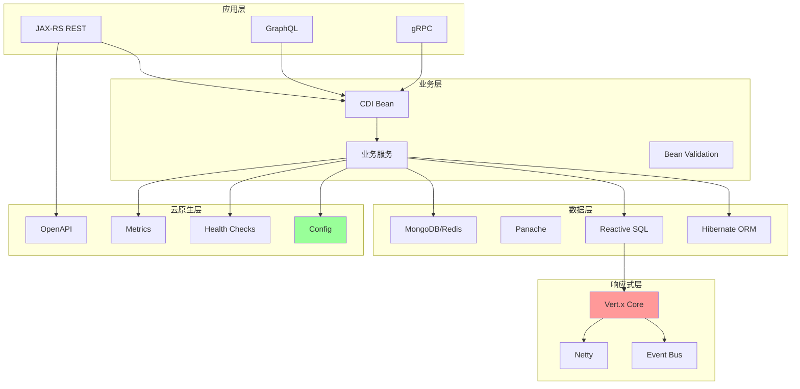

# Quarkus云原生框架

> **学习目标**:掌握Quarkus框架,构建云原生Java应用
> **核心内容**:Quarkus架构、开发体验、GraalVM集成、Kubernetes部署
> **预计时间**:12小时

## Quarkus概述

### 什么是Quarkus

```java
/**
 * Quarkus介绍
 */
public class QuarkusIntroduction {

    /*
    Quarkus是一个专为GraalVM和OpenJDK HotSpot量身定制的Kubernetes原生Java框架。

    核心理念: "Supersonic Subatomic Java"
    - Supersonic: 极速启动
    - Subatomic: 低内存占用

    核心特性:
    1. 原生支持GraalVM
    2. 实时重载(Dev Mode)
    3. 统一配置
    4. 云原生优先
    5. 响应式编程
    6. 可扩展架构

    技术栈:
    - CDI (Contexts and Dependency Injection)
    - JAX-RS (REST API)
    - Hibernate ORM
    - Reactive Extensions
    - MicroProfile规范

    与Spring Boot对比:
    - 更快的启动速度(10-100倍)
    - 更低的内存占用(1/5到1/10)
    - 更好的开发者体验
    - 更适合云原生环境
    */

    public static void main(String[] args) {
        System.out.println("=== Quarkus vs Spring Boot ===\n");

        System.out.println("启动时间:");
        System.out.println("  Quarkus Native:    ~0.01秒");
        System.out.println("  Quarkus JVM:       ~1秒");
        System.out.println("  Spring Boot JVM:   ~5秒\n");

        System.out.println("内存占用:");
        System.out.println("  Quarkus Native:    ~30MB");
        System.out.println("  Quarkus JVM:       ~100MB");
        System.out.println("  Spring Boot JVM:   ~300MB\n");

        System.out.println("首请求响应(RTT):");
        System.out.println("  Quarkus Native:    ~10ms");
        System.out.println("  Quarkus JVM:       ~50ms");
        System.out.println("  Spring Boot JVM:   ~200ms(需预热)\n");
    }
}
```

### Quarkus架构



## 项目创建

### 使用代码生成器

```bash
# 访问 https://code.quarkus.io/
# 或使用CLI

# 安装Quarkus CLI
curl -Ls https://sh.jbang.dev/devtools | bash -s quarkus

# 创建项目
quarkus create app my-quarkus-app \
    --extensions=rest,jdbc-postgresql,hibernate-orm,hibernate-validator

# 或使用Maven
mvn io.quarkus:quarkus-maven-plugin:create \
    -DprojectGroupId=com.example \
    -DprojectArtifactId=quarkus-demo \
    -Dextensions="rest,jdbc-postgresql,hibernate-orm"

# 项目结构
quarkus-demo/
├── src/
│   ├── main/
│   │   ├── docker/
│   │   ├── java/
│   │   └── resources/
│   │       ├── application.properties
│   │       └── META-INF/
│   └── test/
└── pom.xml
```

### Maven配置

```xml
<?xml version="1.0" encoding="UTF-8"?>
<project xmlns="http://maven.apache.org/POM/4.0.0"
         xmlns:xsi="http://www.w3.org/2001/XMLSchema-instance"
         xsi:schemaLocation="http://maven.apache.org/POM/4.0.0
         http://maven.apache.org/xsd/maven-4.0.0.xsd">
    <modelVersion>4.0.0</modelVersion>

    <groupId>com.example</groupId>
    <artifactId>quarkus-demo</artifactId>
    <version>1.0.0-SNAPSHOT</version>

    <properties>
        <maven.compiler.source>17</maven.compiler.source>
        <maven.compiler.target>17</maven.compiler.target>
        <project.build.sourceEncoding>UTF-8</project.build.sourceEncoding>
        <quarkus.version>3.6.0</quarkus.version>
    </properties>

    <dependencyManagement>
        <dependencies>
            <dependency>
                <groupId>io.quarkus</groupId>
                <artifactId>quarkus-bom</artifactId>
                <version>${quarkus.version}</version>
                <type>pom</type>
                <scope>import</scope>
            </dependency>
        </dependencies>
    </dependencyManagement>

    <dependencies>
        <!-- Quarkus REST -->
        <dependency>
            <groupId>io.quarkus</groupId>
            <artifactId>quarkus-resteasy-reactive</artifactId>
        </dependency>
        <dependency>
            <groupId>io.quarkus</groupId>
            <artifactId>quarkus-resteasy-reactive-jackson</artifactId>
        </dependency>

        <!-- Quarkus JDBC -->
        <dependency>
            <groupId>io.quarkus</groupId>
            <artifactId>quarkus-jdbc-postgresql</artifactId>
        </dependency>

        <!-- Quarkus Hibernate ORM -->
        <dependency>
            <groupId>io.quarkus</groupId>
            <artifactId>quarkus-hibernate-orm</artifactId>
        </dependency>
        <dependency>
            <groupId>io.quarkus</groupId>
            <artifactId>quarkus-hibernate-orm-panache</artifactId>
        </dependency>

        <!-- Quarkus Config -->
        <dependency>
            <groupId>io.quarkus</groupId>
            <artifactId>quarkus-arc</artifactId>
        </dependency>

        <!-- Quarkus Validator -->
        <dependency>
            <groupId>io.quarkus</groupId>
            <artifactId>quarkus-hibernate-validator</artifactId>
        </dependency>
    </dependencies>

    <build>
        <plugins>
            <plugin>
                <groupId>io.quarkus</groupId>
                <artifactId>quarkus-maven-plugin</artifactId>
                <version>${quarkus.version}</version>
                <executions>
                    <execution>
                        <goals>
                            <goal>build</goal>
                        </goals>
                    </execution>
                </executions>
            </plugin>
        </plugins>
    </build>
</project>
```

## 核心功能

### REST API

```java
package com.example.quarkus.resource;

import com.example.quarkus.model.User;
import com.example.quarkus.service.UserService;
import io.smallrye.mutiny.Uni;
import jakarta.inject.Inject;
import jakarta.validation.Valid;
import jakarta.ws.rs.*;
import jakarta.ws.rs.core.MediaType;
import jakarta.ws.rs.core.Response;

import java.net.URI;
import java.util.List;

/**
 * 用户资源(JAX-RS)
 */
@Path("/api/users")
@Produces(MediaType.APPLICATION_JSON)
@Consumes(MediaType.APPLICATION_JSON)
public class UserResource {

    @Inject
    UserService userService;

    /**
     * 获取所有用户
     */
    @GET
    public Uni<List<User>> listUsers() {
        return userService.listAll();
    }

    /**
     * 根据ID获取用户
     */
    @GET
    @Path("/{id}")
    public Uni<User> getUser(@PathParam("id") Long id) {
        return userService.findById(id);
    }

    /**
     * 创建用户
     */
    @POST
    public Uni<Response> createUser(@Valid User user) {
        return userService.create(user)
                .onItem().transform(created -> {
                    return Response.created(URI.create("/api/users/" + created.getId()))
                            .entity(created)
                            .build();
                });
    }

    /**
     * 更新用户
     */
    @PUT
    @Path("/{id}")
    public Uni<User> updateUser(@PathParam("id") Long id, @Valid User user) {
        return userService.update(id, user);
    }

    /**
     * 删除用户
     */
    @DELETE
    @Path("/{id}")
    public Uni<Response> deleteUser(@PathParam("id") Long id) {
        return userService.delete(id)
                .onItem().transform(deleted -> deleted
                        ? Response.noContent().build()
                        : Response.status(Response.Status.NOT_FOUND).build());
    }

    /**
     * 搜索用户
     */
    @GET
    @Path("/search")
    public Uni<List<User>> searchUsers(@QueryParam("keyword") String keyword) {
        return userService.search(keyword);
    }
}
```

### Panache实体

```java
package com.example.quarkus.model;

import io.quarkus.hibernate.orm.panache.PanacheEntity;
import io.quarkus.hibernate.orm.panache.PanacheEntityBase;
import jakarta.persistence.*;

/**
 * 用户实体(Panache)
 */
@Entity
@Table(name = "users")
public class User extends PanacheEntity {

    @Column(nullable = false, unique = true, length = 50)
    private String username;

    @Column(nullable = false, length = 100)
    private String email;

    @Column(length = 20)
    private String phone;

    @Column(name = "created_at", updatable = false)
    private Long createdAt;

    @Column(name = "updated_at")
    private Long updatedAt;

    // Active Record模式
    public static User findByName(String username) {
        return find("username", username).firstResult();
    }

    public static List<User> searchByKeyword(String keyword) {
        return list("username like ?1 or email like ?1", "%" + keyword + "%");
    }

    // Getters and Setters
    public String getUsername() { return username; }
    public void setUsername(String username) { this.username = username; }
    public String getEmail() { return email; }
    public void setEmail(String email) { this.email = email; }
    public String getPhone() { return phone; }
    public void setPhone(String phone) { this.phone = phone; }
    public Long getCreatedAt() { return createdAt; }
    public void setCreatedAt(Long createdAt) { this.createdAt = createdAt; }
    public Long getUpdatedAt() { return updatedAt; }
    public void setUpdatedAt(Long updatedAt) { this.updatedAt = updatedAt; }

    @PrePersist
    void onCreate() {
        this.createdAt = System.currentTimeMillis();
        this.updatedAt = System.currentTimeMillis();
    }

    @PreUpdate
    void onUpdate() {
        this.updatedAt = System.currentTimeMillis();
    }
}
```

### Repository模式

```java
package com.example.quarkus.repository;

import com.example.quarkus.model.User;
import io.quarkus.hibernate.orm.panache.PanacheRepository;
import io.smallrye.mutiny.Uni;
import jakarta.enterprise.context.ApplicationScoped;

import java.util.List;

/**
 * 用户Repository
 */
@ApplicationScoped
public class UserRepository implements PanacheRepository<User> {

    /**
     * 根据用户名查找
     */
    public Uni<User> findByUsername(String username) {
        return find("username", username).firstResult();
    }

    /**
     * 根据邮箱查找
     */
    public Uni<User> findByEmail(String email) {
        return find("email", email).firstResult();
    }

    /**
     * 搜索用户
     */
    public Uni<List<User>> search(String keyword) {
        return list("username like ?1 or email like ?1",
                "%" + keyword + "%");
    }

    /**
     * 检查用户名是否存在
     */
    public Uni<Boolean> existsByUsername(String username) {
        return count("username", username)
                .map(count -> count > 0);
    }

    /**
     * 检查邮箱是否存在
     */
    public Uni<Boolean> existsByEmail(String email) {
        return count("email", email)
                .map(count -> count > 0);
    }
}
```

### Service层

```java
package com.example.quarkus.service;

import com.example.quarkus.model.User;
import com.example.quarkus.repository.UserRepository;
import io.smallrye.mutiny.Uni;
import jakarta.enterprise.context.ApplicationScoped;
import jakarta.inject.Inject;

import java.util.List;

/**
 * 用户服务
 */
@ApplicationScoped
public class UserService {

    @Inject
    UserRepository userRepository;

    /**
     * 获取所有用户
     */
    public Uni<List<User>> listAll() {
        return userRepository.listAll();
    }

    /**
     * 根据ID查找
     */
    public Uni<User> findById(Long id) {
        return userRepository.findById(id);
            .onItem().ifNull().failWith(() ->
                new NotFoundException("User not found: " + id)
            );
    }

    /**
     * 创建用户
     */
    public Uni<User> create(User user) {
        // 验证用户名唯一性
        return userRepository.existsByUsername(user.getUsername())
            .flatMap(exists -> {
                if (exists) {
                    return Uni.createFrom().failure(
                        new BadRequestException("Username already exists")
                    );
                }

                // 验证邮箱唯一性
                return userRepository.existsByEmail(user.getEmail())
                    .flatMap(emailExists -> {
                        if (emailExists) {
                            return Uni.createFrom().failure(
                                new BadRequestException("Email already exists")
                            );
                        }

                        // 创建用户
                        return userRepository.persist(user)
                            .replaceWith(user);
                    });
            });
    }

    /**
     * 更新用户
     */
    public Uni<User> update(Long id, User user) {
        return findById(id)
            .flatMap(existingUser -> {
                existingUser.setUsername(user.getUsername());
                existingUser.setEmail(user.getEmail());
                existingUser.setPhone(user.getPhone());
                return userRepository.persist(existingUser)
                    .replaceWith(existingUser);
            });
    }

    /**
     * 删除用户
     */
    public Uni<Boolean> delete(Long id) {
        return userRepository.deleteById(id);
    }

    /**
     * 搜索用户
     */
    public Uni<List<User>> search(String keyword) {
        return userRepository.search(keyword);
    }

    public static class NotFoundException extends RuntimeException {
        public NotFoundException(String message) {
            super(message);
        }
    }

    public static class BadRequestException extends RuntimeException {
        public BadRequestException(String message) {
            super(message);
        }
    }
}
```

## 响应式编程

### 响应式REST API

```java
package com.example.quarkus.reactive;

import io.smallrye.mutiny.Multi;
import io.smallrye.mutiny.Uni;
import jakarta.ws.rs.*;
import jakarta.ws.rs.core.MediaType;
import org.jboss.resteasy.reactive.RestSse;

/**
 * 响应式资源
 */
@Path("/api/reactive")
@Produces(MediaType.APPLICATION_JSON)
public class ReactiveResource {

    /**
     * Uni示例: 返回单个结果
     */
    @GET
    @Path("/user/{id}")
    public Uni<User> getUser(@PathParam("id") Long id) {
        return Uni.createFrom().item(() -> {
            // 模拟数据库查询
            return new User(id, "user" + id);
        });
    }

    /**
     * Multi示例: 返回多个结果
     */
    @GET
    @Path("/users")
    public Multi<User> streamUsers() {
        return Multi.createFrom().items(
            new User(1L, "user1"),
            new User(2L, "user2"),
            new User(3L, "user3")
        );
    }

    /**
     * Server-Sent Events
     */
    @GET
    @Path("/events")
    @Produces(MediaType.SERVER_SENT_EVENTS)
    @RestSse
    public Multi<String> streamEvents() {
        return Multi.createFrom().ticks()
            .every(1)
            .onItem().transform(n -> "Event " + n);
    }

    /**
     * 响应式链式调用
     */
    @GET
    @Path("/chain")
    public Uni<String> reactiveChain() {
        return Uni.createFrom().item("Hello")
            .map(s -> s + " World")
            .onItem().delayIt().by(org.jboss.resteasy.reactive.Duration.ofMillis(100))
            .map(s -> s + "!");
    }

    record User(Long id, String username) {}
}
```

### 响应式数据库访问

```java
package com.example.quarkus.repository;

import io.quarkus.hibernate.reactive.panache.PanacheRepository;
import io.smallrye.mutiny.Uni;
import jakarta.enterprise.context.ApplicationScoped;

/**
 * 响应式Repository
 */
@ApplicationScoped
public class ReactiveUserRepository implements PanacheRepository<User> {

    /**
     * 异步查询
     */
    public Uni<User> findByIdAsync(Long id) {
        return findById(id);
    }

    /**
     * 批量操作
     */
    public Uni<Void> batchInsert(User... users) {
        return Uni.combine().all().unis(
            java.util.Arrays.stream(users)
                .map(this::persist)
                .toArray(Uni[]::new)
        ).discardItems();
    }
}
```

## 开发体验

### Dev Mode

```bash
# 启动开发模式
./mvnw quarkus:dev

# 访问Dev UI
# http://localhost:8080/q/dev

# 特性:
# - 自动代码重载
# - 热重载(保存即生效)
# - Dev UI界面
# - 测试运行
# - 配置浏览
```

### 配置管理

```properties
# src/main/resources/application.properties

# 应用配置
quarkus.application.name=quarkus-demo
quarkus.http.port=8080

# 数据源配置
quarkus.datasource.db-kind=postgresql
quarkus.datasource.username=quarkus
quarkus.datasource.password=quarkus
quarkus.datasource.jdbc.url=jdbc:postgresql://localhost:5432/quarkus_db

# Hibernate ORM配置
quarkus.hibernate-orm.database.generation=update
quarkus.hibernate-orm.sql-load-script=import.sql

# 日志配置
quarkus.log.level=INFO
quarkus.log.category."com.example".level=DEBUG

# 健康检查
quarkus.smallrye-health.enabled=true

# 指标收集
quarkus.smallrye-metrics.enabled=true

# OpenAPI
quarkus.swagger-ui.always-include=true

# Native Image配置
quarkus.native.enabled=true
quarkus.native.container-build=true

# Profile配置
%dev.quarkus.hibernate-orm.database.generation=drop-and-create
%prod.quarkus.hibernate-orm.database.generation=none

# 环境变量覆盖
quarkus.datasource.username=${DATABASE_USER:quarkus}
quarkus.datasource.password=${DATABASE_PASSWORD:quarkus}
```

### 测试

```java
package com.example.quarkus;

import io.quarkus.test.junit.QuarkusTest;
import org.junit.jupiter.api.Test;

import static io.restassured.RestAssured.given;
import static org.hamcrest.CoreMatchers.is;

@QuarkusTest
public class UserResourceTest {

    @Test
    public void testGetUser() {
        given()
            .pathParam("id", 1)
        .when()
            .get("/api/users/{id}")
        .then()
            .statusCode(200)
            .body("username", is("user1"));
    }

    @Test
    public void testCreateUser() {
        given()
            .body("{\"username\":\"test\",\"email\":\"test@example.com\"}")
            .contentType("application/json")
        .when()
            .post("/api/users")
        .then()
            .statusCode(201)
            .body("username", is("test"));
    }

    @Test
    public void testListUsers() {
        given()
        .when()
            .get("/api/users")
        .then()
            .statusCode(200)
            .body("$.size()", is(3));
    }
}
```

## GraalVM Native Image

### 构建Native镜像

```bash
# 构建Native可执行文件
./mvnw package -Pnative

# 运行Native应用
./target/quarkus-demo-1.0.0-SNAPSHOT-runner

# 性能对比
# JVM模式启动: ~1秒, 内存~100MB
# Native模式启动: ~0.01秒, 内存~30MB
```

### Docker构建

```dockerfile
# Dockerfile.native
FROM quay.io/quarkus/centos-quarkus-maven:21.2.0-java11 AS build
WORKDIR /build
COPY pom.xml src/ /build/
RUN mvn package -Pnative -DskipTests

FROM scratch
COPY --from=build /build/target/*-runner /application
EXPOSE 8080
CMD ["./application", "-Dquarkus.http.host=0.0.0.0"]
```

```yaml
# docker-compose.yml
version: '3.8'
services:
  quarkus-app:
    build:
      context: .
      dockerfile: Dockerfile.native
    ports:
      - "8080:8080"
    environment:
      - QUARKUS_DATASOURCE_URL=jdbc:postgresql://db:5432/quarkus_db
    depends_on:
      - db

  db:
    image: postgres:15
    environment:
      - POSTGRES_USER=quarkus
      - POSTGRES_PASSWORD=quarkus
      - POSTGRES_DB=quarkus_db
```

## Kubernetes部署

### Kubernetes配置

```yaml
# deployment.yaml
apiVersion: apps/v1
kind: Deployment
metadata:
  name: quarkus-demo
spec:
  replicas: 3
  selector:
    matchLabels:
      app: quarkus-demo
  template:
    metadata:
      labels:
        app: quarkus-demo
    spec:
      containers:
      - name: quarkus-demo
        image: quay.io/myorg/quarkus-demo:1.0.0
        ports:
        - containerPort: 8080
        env:
        - name: QUARKUS_DATASOURCE_URL
          valueFrom:
            configMapKeyRef:
              name: db-config
              key: url
        - name: QUARKUS_DATASOURCE_USERNAME
          valueFrom:
            secretKeyRef:
              name: db-secret
              key: username
        - name: QUARKUS_DATASOURCE_PASSWORD
          valueFrom:
            secretKeyRef:
              name: db-secret
              key: password
        livenessProbe:
          httpGet:
            path: /q/health/live
            port: 8080
          initialDelaySeconds: 5
          periodSeconds: 10
        readinessProbe:
          httpGet:
            path: /q/health/ready
            port: 8080
          initialDelaySeconds: 5
          periodSeconds: 10
---
apiVersion: v1
kind: Service
metadata:
  name: quarkus-demo
spec:
  selector:
    app: quarkus-demo
  ports:
  - protocol: TCP
    port: 80
    targetPort: 8080
  type: LoadBalancer
```

### ConfigMap和Secret

```yaml
# configmap.yaml
apiVersion: v1
kind: ConfigMap
metadata:
  name: db-config
data:
  url: jdbc:postgresql://postgres:5432/quarkus_db

---
# secret.yaml
apiVersion: v1
kind: Secret
metadata:
  name: db-secret
type: Opaque
data:
  username: cXVhcmt1cw==  # base64 encoded "quarkus"
  password: cXVhcmt1cw==  # base64 encoded "quarkus"
```

### 部署

```bash
# 构建并推送镜像
docker build -t quay.io/myorg/quarkus-demo:1.0.0 .
docker push quay.io/myorg/quarkus-demo:1.0.0

# 部署到Kubernetes
kubectl apply -f k8s/

# 验证部署
kubectl get pods
kubectl logs -f deployment/quarkus-demo
```

## Quarkus vs Spring Boot

### 详细对比

```java
package com.example.comparison;

/**
 * Quarkus vs Spring Boot对比
 */
public class FrameworkComparison {

    /*
    启动时间对比:
    =============
    Quarkus Native:    10-50ms
    Quarkus JVM:       500-1000ms
    Spring Boot JVM:   3-10秒

    内存占用对比:
    =============
    Quarkus Native:    30-50MB
    Quarkus JVM:       100-150MB
    Spring Boot JVM:   200-500MB

    RSS(峰值内存)对比:
    ===================
    Quarkus Native:    50-80MB
    Quarkus JVM:       150-200MB
    Spring Boot JVM:   300-800MB

    首请求响应对比:
    =================
    Quarkus Native:    即时峰值性能
    Quarkus JVM:       需要预热(100-200ms)
    Spring Boot JVM:   需要预热(500-2000ms)

    开发体验对比:
    =============
    Quarkus:
    ✅ Dev Mode实时重载
    ✅ 统一配置系统
    ✅ 内置开发工具
    ✅ 更快的构建速度

    Spring Boot:
    ✅ 更成熟的生态
    ✅ 更多的扩展
    ✅ 更大的社区
    ✅ 更多的学习资源

    适用场景:
    =========
    Quarkus优势:
    ✅ Kubernetes环境
    ✅ Serverless函数
    ✅ 微服务架构
    ✅ 资源受限环境
    ✅ 需要快速启动

    Spring Boot优势:
    ✅ 传统应用服务器
    ✅ 长期运行的服务
    ✅ 复杂的企业应用
    ✅ 需要丰富的集成
    ✅ 团队更熟悉Spring
    */
}
```

## 最佳实践

### Quarkus最佳实践

```java
package com.example.bestpractice;

/**
 * Quarkus最佳实践
 */
public class QuarkusBestPractices {

    /*
    1. 依赖注入
    ============
    ✅ 使用CDI注解(@Inject, @ApplicationScoped)
    ✅ 优先使用@ApplicationScoped而非@Singleton
    ✅ 合理使用生命周期注解

    2. 响应式编程
    ============
    ✅ IO密集型操作使用Uni/Multi
    ✅ 利用响应式优势提高并发
    ✅ 避免在响应式链中阻塞

    3. 数据库访问
    ============
    ✅ 使用Panache简化CRUD
    ✅ 利用Hibernate Reactive
    ✅ 批量操作使用事务

    4. 配置管理
    ============
    ✅ 使用@ConfigProperty注入配置
    ✅ 使用Profile区分环境
    ✅ 敏感配置使用环境变量

    5. 错误处理
    ============
    ✅ 使用统一异常处理
    ✅ 返回合适的HTTP状态码
    ✅ 记录详细的错误日志

    6. 测试
    ============
    ✅ 使用@QuarkusTest集成测试
    ✅ 测试覆盖关键业务逻辑
    ✅ 使用@Nested组织测试
    */

    // 示例1: CDI最佳实践
    @ApplicationScoped
    public class UserService {
        // 使用@ApplicationScoped获得更好的性能
    }

    // 示例2: 配置注入
    @ApplicationScoped
    public class DatabaseConfig {
        @ConfigProperty(name = "database.url")
        String url;

        @ConfigProperty(name = "database.pool.size", defaultValue = "10")
        int poolSize;
    }

    // 示例3: 响应式编程
    @ApplicationScoped
    public class ReactiveService {
        public Uni<String> processData() {
            return Uni.createFrom().item("data")
                .map(s -> s.toUpperCase())
                .onFailure().recoverWithItem("fallback");
        }
    }
}
```

## 本章小结

### 知识总结

✅ **Quarkus架构**: Supersonic Subatomic Java
✅ **开发体验**: Dev Mode实时重载
✅ **响应式编程**: Uni/Multi响应式模型
✅ **Panache ORM**: 简化数据库访问
✅ **云原生**: Kubernetes友好

### 核心要点

1. **Quarkus优势**
   - 启动快10-100倍
   - 内存占用少5-10倍
   - 开发体验更好
   - 云原生优先

2. **核心特性**
   - Dev Mode实时重载
   - 原生支持GraalVM
   - 响应式编程模型
   - 统一配置系统

3. **适用场景**
   - Kubernetes环境
   - Serverless函数
   - 微服务架构
   - 资源受限环境

4. **与Spring Boot对比**
   - Quarkus: 更快启动、更低内存
   - Spring Boot: 更成熟生态、更多扩展

### 实践练习

**练习1: 创建Quarkus项目**
- 使用代码生成器创建项目
- 实现REST API
- 使用Dev Mode开发

**练习2: 响应式编程**
- 实现响应式REST API
- 使用Uni/Multi处理数据流
- 测试响应式性能

**练习3: Kubernetes部署**
- 构建Native镜像
- 编写Kubernetes配置
- 部署到K8s集群

---

**学习时间**: 约12小时
**难度等级**: ★★★★☆
**重要程度**: ★★★★★

**下一步学习**: 第33章《事件驱动架构》
