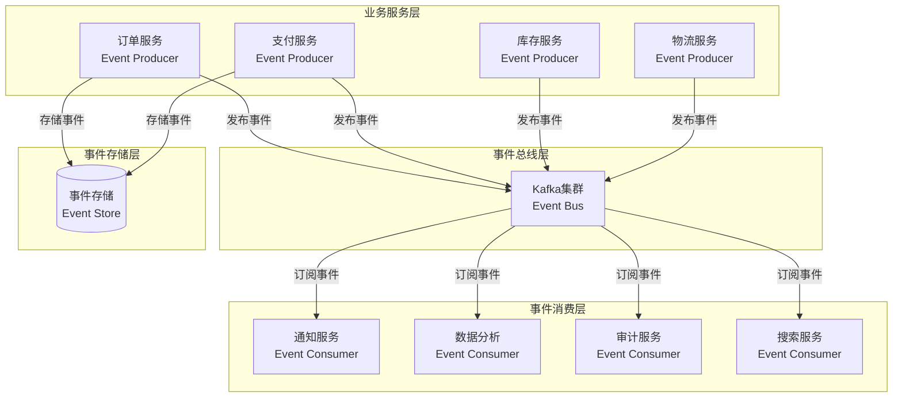
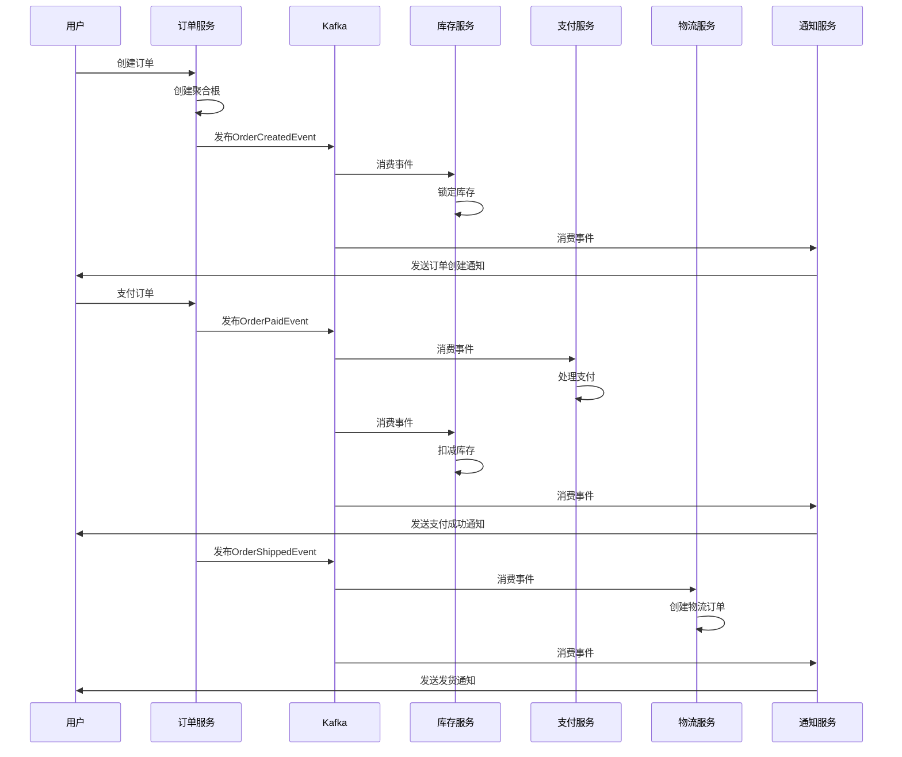

# 事件驱动架构

> **学习目标**:掌握事件驱动架构设计,实现解耦的分布式系统
> **核心内容**:事件风暴、事件溯源、CQRS、Saga模式、Kafka集成
> **预计时间**:14小时

## 事件驱动架构概述

### 什么是事件驱动架构

```java
/**
 * 事件驱动架构介绍
 */
public class EventDrivenArchitecture {

    /*
    事件驱动架构(Event-Driven Architecture, EDA)是一种分布式系统架构模式,
    通过事件在服务之间传递状态变化,实现服务间的松耦合。

    核心概念:
    1. 事件(Event): 系统中发生的状态变化
    2. 事件生产者(Event Producer): 产生事件的服务
    3. 事件消费者(Event Consumer): 处理事件的服务
    4. 事件总线(Event Bus): 传递事件的通道
    5. 事件存储(Event Store): 持久化事件的存储

    核心特性:
    1. 异步通信: 服务间异步传递事件
    2. 松耦合: 服务间通过事件通信,不直接依赖
    3. 可扩展性: 易于添加新的事件消费者
    4. 最终一致性: 通过事件保证数据最终一致

    适用场景:
    1. 微服务架构
    2. 需要审计的系统
    3. 复杂业务流程
    4. 高并发系统
    5. 需要解耦的系统
    */

    public static void main(String[] args) {
        System.out.println("=== 事件驱动架构 vs 传统架构 ===\n");

        System.out.println("传统同步架构:");
        System.out.println("  - 服务间直接调用");
        System.out.println("  - 强耦合");
        System.out.println("  - 同步阻塞");
        System.out.println("  - 难以扩展");
        System.out.println("  - 单点故障风险高\n");

        System.out.println("事件驱动架构:");
        System.out.println("  - 服务间通过事件通信");
        System.out.println("  - 松耦合");
        System.out.println("  - 异步非阻塞");
        System.out.println("  - 易于扩展");
        System.out.println("  - 高可用性");
        System.out.println("  - 可追溯性强\n");
    }
}
```

### EDA架构图



## 领域事件

### 事件定义

```java
package com.example.ecommerce.event;

import java.time.Instant;
import java.util.UUID;

/**
 * 领域事件基类
 */
public abstract class DomainEvent {

    private final String eventId = UUID.randomUUID().toString();
    private final Instant occurredOn = Instant.now();
    private final String eventType;

    protected DomainEvent() {
        this.eventType = this.getClass().getSimpleName();
    }

    public String getEventId() {
        return eventId;
    }

    public Instant getOccurredOn() {
        return occurredOn;
    }

    public String getEventType() {
        return eventType;
    }
}
```

### 订单事件

```java
package com.example.ecommerce.order.event;

import com.example.ecommerce.event.DomainEvent;
import java.math.BigDecimal;

/**
 * 订单创建事件
 */
public class OrderCreatedEvent extends DomainEvent {

    private final String orderId;
    private final String userId;
    private final BigDecimal totalAmount;
    private final String orderStatus;

    public OrderCreatedEvent(String orderId, String userId,
                            BigDecimal totalAmount, String orderStatus) {
        super();
        this.orderId = orderId;
        this.userId = userId;
        this.totalAmount = totalAmount;
        this.orderStatus = orderStatus;
    }

    // Getters
    public String getOrderId() { return orderId; }
    public String getUserId() { return userId; }
    public BigDecimal getTotalAmount() { return totalAmount; }
    public String getOrderStatus() { return orderStatus; }
}

/**
 * 订单支付事件
 */
public class OrderPaidEvent extends DomainEvent {

    private final String orderId;
    private final String paymentId;
    private final BigDecimal paidAmount;
    private final String paymentMethod;

    public OrderPaidEvent(String orderId, String paymentId,
                         BigDecimal paidAmount, String paymentMethod) {
        super();
        this.orderId = orderId;
        this.paymentId = paymentId;
        this.paidAmount = paidAmount;
        this.paymentMethod = paymentMethod;
    }

    // Getters
    public String getOrderId() { return orderId; }
    public String getPaymentId() { return paymentId; }
    public BigDecimal getPaidAmount() { return paidAmount; }
    public String getPaymentMethod() { return paymentMethod; }
}

/**
 * 订单发货事件
 */
public class OrderShippedEvent extends DomainEvent {

    private final String orderId;
    private final String shippingId;
    private final String trackingNumber;
    private final String shippingAddress;

    public OrderShippedEvent(String orderId, String shippingId,
                            String trackingNumber, String shippingAddress) {
        super();
        this.orderId = orderId;
        this.shippingId = shippingId;
        this.trackingNumber = trackingNumber;
        this.shippingAddress = shippingAddress;
    }

    // Getters
    public String getOrderId() { return orderId; }
    public String getShippingId() { return shippingId; }
    public String getTrackingNumber() { return trackingNumber; }
    public String getShippingAddress() { return shippingAddress; }
}
```

### 事件发布

```java
package com.example.ecommerce.order.service;

import com.example.ecommerce.event.DomainEvent;
import com.example.ecommerce.event.EventPublisher;
import org.springframework.beans.factory.annotation.Autowired;
import org.springframework.stereotype.Service;

import java.util.ArrayList;
import java.util.List;

/**
 * 订单服务
 */
@Service
public class OrderService {

    @Autowired
    private EventPublisher eventPublisher;

    private final List<DomainEvent> pendingEvents = new ArrayList<>();

    /**
     * 创建订单
     */
    public Order createOrder(OrderCreateRequest request) {
        // 1. 创建订单
        Order order = new Order();
        order.setOrderId(generateOrderId());
        order.setUserId(request.getUserId());
        order.setTotalAmount(request.getTotalAmount());
        order.setStatus(OrderStatus.CREATED);

        // 2. 保存订单
        orderRepository.save(order);

        // 3. 创建领域事件
        OrderCreatedEvent event = new OrderCreatedEvent(
            order.getOrderId(),
            order.getUserId(),
            order.getTotalAmount(),
            order.getStatus().name()
        );

        // 4. 发布事件
        eventPublisher.publish(event);

        return order;
    }

    /**
     * 支付订单
     */
    public void payOrder(String orderId, PaymentRequest paymentRequest) {
        // 1. 查询订单
        Order order = orderRepository.findById(orderId);

        // 2. 更新订单状态
        order.setStatus(OrderStatus.PAID);
        orderRepository.save(order);

        // 3. 发布支付事件
        OrderPaidEvent event = new OrderPaidEvent(
            order.getOrderId(),
            paymentRequest.getPaymentId(),
            paymentRequest.getPaidAmount(),
            paymentRequest.getPaymentMethod()
        );

        eventPublisher.publish(event);
    }

    /**
     * 发货
     */
    public void shipOrder(String orderId, ShippingRequest request) {
        // 1. 查询订单
        Order order = orderRepository.findById(orderId);

        // 2. 更新订单状态
        order.setStatus(OrderStatus.SHIPPED);
        orderRepository.save(order);

        // 3. 发布发货事件
        OrderShippedEvent event = new OrderShippedEvent(
            order.getOrderId(),
            request.getShippingId(),
            request.getTrackingNumber(),
            request.getShippingAddress()
        );

        eventPublisher.publish(event);
    }

    private String generateOrderId() {
        return "ORD" + System.currentTimeMillis();
    }
}
```

## Kafka事件流处理

### Kafka配置

```java
package com.example.ecommerce.config;

import org.apache.kafka.clients.consumer.ConsumerConfig;
import org.apache.kafka.clients.producer.ProducerConfig;
import org.apache.kafka.common.serialization.StringDeserializer;
import org.apache.kafka.common.serialization.StringSerializer;
import org.springframework.context.annotation.Bean;
import org.springframework.context.annotation.Configuration;
import org.springframework.kafka.config.ConcurrentKafkaListenerContainerFactory;
import org.springframework.kafka.core.*;
import org.springframework.kafka.listener.ContainerProperties;

import java.util.HashMap;
import java.util.Map;

/**
 * Kafka配置
 */
@Configuration
public class KafkaConfig {

    @Bean
    public ProducerFactory<String, String> producerFactory() {
        Map<String, Object> configProps = new HashMap<>();
        configProps.put(ProducerConfig.BOOTSTRAP_SERVERS_CONFIG, "localhost:9092");
        configProps.put(ProducerConfig.KEY_SERIALIZER_CLASS_CONFIG, StringSerializer.class);
        configProps.put(ProducerConfig.VALUE_SERIALIZER_CLASS_CONFIG, StringSerializer.class);
        configProps.put(ProducerConfig.ACKS_CONFIG, "all");
        configProps.put(ProducerConfig.RETRIES_CONFIG, 3);
        configProps.put(ProducerConfig.ENABLE_IDEMPOTENCE_CONFIG, true);
        return new DefaultKafkaProducerFactory<>(configProps);
    }

    @Bean
    public KafkaTemplate<String, String> kafkaTemplate() {
        return new KafkaTemplate<>(producerFactory());
    }

    @Bean
    public ConsumerFactory<String, String> consumerFactory() {
        Map<String, Object> configProps = new HashMap<>();
        configProps.put(ConsumerConfig.BOOTSTRAP_SERVERS_CONFIG, "localhost:9092");
        configProps.put(ConsumerConfig.GROUP_ID_CONFIG, "order-group");
        configProps.put(ConsumerConfig.KEY_DESERIALIZER_CLASS_CONFIG, StringDeserializer.class);
        configProps.put(ConsumerConfig.VALUE_DESERIALIZER_CLASS_CONFIG, StringDeserializer.class);
        configProps.put(ConsumerConfig.ENABLE_AUTO_COMMIT_CONFIG, false);
        configProps.put(ConsumerConfig.AUTO_OFFSET_RESET_CONFIG, "earliest");
        return new DefaultKafkaConsumerFactory<>(configProps);
    }

    @Bean
    public ConcurrentKafkaListenerContainerFactory<String, String>
            kafkaListenerContainerFactory() {

        ConcurrentKafkaListenerContainerFactory<String, String> factory =
                new ConcurrentKafkaListenerContainerFactory<>();
        factory.setConsumerFactory(consumerFactory());
        factory.getContainerProperties().setAckMode(ContainerProperties.AckMode.MANUAL);
        return factory;
    }
}
```

### 事件发布者

```java
package com.example.ecommerce.event;

import com.fasterxml.jackson.databind.ObjectMapper;
import org.springframework.beans.factory.annotation.Autowired;
import org.springframework.kafka.core.KafkaTemplate;
import org.springframework.stereotype.Component;

/**
 * 事件发布者
 */
@Component
public class EventPublisher {

    @Autowired
    private KafkaTemplate<String, String> kafkaTemplate;

    @Autowired
    private ObjectMapper objectMapper;

    /**
     * 发布事件
     */
    public void publish(DomainEvent event) {
        try {
            String topic = resolveTopic(event);
            String payload = objectMapper.writeValueAsString(event);

            kafkaTemplate.send(topic, event.getEventId(), payload)
                    .addCallback(
                            result -> System.out.println("事件发布成功: " + event.getEventType()),
                            failure -> System.err.println("事件发布失败: " + failure.getMessage())
                    );

        } catch (Exception e) {
            throw new EventPublishException("事件发布失败", e);
        }
    }

    /**
     * 解析主题名称
     */
    private String resolveTopic(DomainEvent event) {
        // 根据事件类型确定主题
        String eventType = event.getEventType();
        return switch (eventType) {
            case "OrderCreatedEvent" -> "order-events";
            case "OrderPaidEvent" -> "payment-events";
            case "OrderShippedEvent" -> "shipping-events";
            default -> "domain-events";
        };
    }
}
```

### 事件消费者

```java
package com.example.ecommerce.notification;

import com.example.ecommerce.order.event.OrderCreatedEvent;
import com.example.ecommerce.order.event.OrderPaidEvent;
import com.example.ecommerce.order.event.OrderShippedEvent;
import com.fasterxml.jackson.databind.ObjectMapper;
import org.springframework.beans.factory.annotation.Autowired;
import org.springframework.kafka.annotation.KafkaListener;
import org.springframework.kafka.support.Acknowledgment;
import org.springframework.kafka.support.KafkaHeaders;
import org.springframework.messaging.handler.annotation.Header;
import org.springframework.messaging.handler.annotation.Payload;
import org.springframework.stereotype.Component;

/**
 * 事件消费者
 */
@Component
public class EventConsumer {

    @Autowired
    private ObjectMapper objectMapper;

    /**
     * 处理订单创建事件
     */
    @KafkaListener(
        topics = "order-events",
        groupId = "notification-group",
        containerFactory = "kafkaListenerContainerFactory"
    )
    public void handleOrderCreated(
            @Payload String message,
            @Header(KafkaHeaders.RECEIVED_TOPIC) String topic,
            Acknowledgment ack) {

        try {
            OrderCreatedEvent event = objectMapper.readValue(message, OrderCreatedEvent.class);

            // 发送订单创建通知
            sendNotification(event.getUserId(),
                    "订单创建成功",
                    "您的订单 " + event.getOrderId() + " 已创建成功");

            // 手动确认
            if (ack != null) {
                ack.acknowledge();
            }

        } catch (Exception e) {
            System.err.println("处理订单创建事件失败: " + e.getMessage());
            // 可以选择不确认,让Kafka重新投递
        }
    }

    /**
     * 处理订单支付事件
     */
    @KafkaListener(
        topics = "payment-events",
        groupId = "notification-group"
    )
    public void handleOrderPaid(@Payload String message) {
        try {
            OrderPaidEvent event = objectMapper.readValue(message, OrderPaidEvent.class);

            // 发送支付成功通知
            sendNotification(event.getOrderId(),
                    "订单支付成功",
                    "您的订单 " + event.getOrderId() + " 已支付成功,金额: " + event.getPaidAmount());

        } catch (Exception e) {
            System.err.println("处理订单支付事件失败: " + e.getMessage());
        }
    }

    /**
     * 处理订单发货事件
     */
    @KafkaListener(
        topics = "shipping-events",
        groupId = "notification-group"
    )
    public void handleOrderShipped(@Payload String message) {
        try {
            OrderShippedEvent event = objectMapper.readValue(message, OrderShippedEvent.class);

            // 发送发货通知
            sendNotification(event.getOrderId(),
                    "订单已发货",
                    "您的订单 " + event.getOrderId() + " 已发货,物流单号: " + event.getTrackingNumber());

        } catch (Exception e) {
            System.err.println("处理订单发货事件失败: " + e.getMessage());
        }
    }

    private void sendNotification(String userId, String title, String content) {
        // 实际的通知发送逻辑
        System.out.println("发送通知给用户 " + userId + ": " + title);
        System.out.println("内容: " + content);
    }
}
```

## 事件溯源(Event Sourcing)

### Event Store实现

```java
package com.example.ecommerce.eventsourcing;

import com.example.ecommerce.event.DomainEvent;
import com.fasterxml.jackson.databind.ObjectMapper;
import org.springframework.data.annotation.Id;
import org.springframework.data.mongodb.core.mapping.Document;

import java.time.Instant;
import java.util.List;
import java.util.stream.Collectors;

/**
 * 事件存储
 */
@Document(collection = "event_store")
public class EventStore {

    @Id
    private String eventId;
    private String aggregateId;
    private String aggregateType;
    private String eventType;
    private String eventData;
    private Instant version;
    private Instant occurredOn;

    /**
     * 从领域事件创建EventStore
     */
    public static EventStore fromDomainEvent(DomainEvent event, String aggregateId, String aggregateType) {
        try {
            ObjectMapper mapper = new ObjectMapper();
            EventStore store = new EventStore();
            store.setEventId(event.getEventId());
            store.setAggregateId(aggregateId);
            store.setAggregateType(aggregateType);
            store.setEventType(event.getEventType());
            store.setEventData(mapper.writeValueAsString(event));
            store.setOccurredOn(event.getOccurredOn());
            return store;
        } catch (Exception e) {
            throw new RuntimeException("事件序列化失败", e);
        }
    }

    /**
     * 转换为领域事件
     */
    public DomainEvent toDomainEvent() {
        try {
            ObjectMapper mapper = new ObjectMapper();
            Class<?> eventClass = Class.forName(eventType);
            return (DomainEvent) mapper.readValue(eventData, eventClass);
        } catch (Exception e) {
            throw new RuntimeException("事件反序列化失败", e);
        }
    }

    // Getters and Setters
    public String getEventId() { return eventId; }
    public void setEventId(String eventId) { this.eventId = eventId; }
    public String getAggregateId() { return aggregateId; }
    public void setAggregateId(String aggregateId) { this.aggregateId = aggregateId; }
    public String getAggregateType() { return aggregateType; }
    public void setAggregateType(String aggregateType) { this.aggregateType = aggregateType; }
    public String getEventType() { return eventType; }
    public void setEventType(String eventType) { this.eventType = eventType; }
    public String getEventData() { return eventData; }
    public void setEventData(String eventData) { this.eventData = eventData; }
    public Instant getVersion() { return version; }
    public void setVersion(Instant version) { this.version = version; }
    public Instant getOccurredOn() { return occurredOn; }
    public void setOccurredOn(Instant occurredOn) { this.occurredOn = occurredOn; }
}
```

### Aggregate Root

```java
package com.example.ecommerce.eventsourcing;

import com.example.ecommerce.event.DomainEvent;
import java.util.ArrayList;
import java.util.List;

/**
 * 聚合根
 */
public abstract class AggregateRoot {

    private final String aggregateId;
    private final List<DomainEvent> uncommittedEvents = new ArrayList<>();
    private long version = 0;

    protected AggregateRoot(String aggregateId) {
        this.aggregateId = aggregateId;
    }

    /**
     * 应用事件
     */
    protected void applyChange(DomainEvent event) {
        // 应用事件到聚合根
        apply(event);
        // 添加到未提交事件列表
        uncommittedEvents.add(event);
        // 增加版本号
        version++;
    }

    /**
     * 从历史事件重建聚合根
     */
    public void loadFromHistory(List<DomainEvent> history) {
        for (DomainEvent event : history) {
            apply(event);
            version++;
        }
    }

    /**
     * 获取未提交的事件
     */
    public List<DomainEvent> getUncommittedEvents() {
        return List.copyOf(uncommittedEvents);
    }

    /**
     * 标记事件为已提交
     */
    public void markEventsAsCommitted() {
        uncommittedEvents.clear();
    }

    /**
     * 应用事件(子类实现)
     */
    protected abstract void apply(DomainEvent event);

    public String getAggregateId() {
        return aggregateId;
    }

    public long getVersion() {
        return version;
    }
}
```

### Order聚合根

```java
package com.example.ecommerce.order;

import com.example.ecommerce.eventsourcing.AggregateRoot;
import com.example.ecommerce.event.DomainEvent;
import com.example.ecommerce.order.event.*;
import java.math.BigDecimal;

/**
 * 订单聚合根(事件溯源版本)
 */
public class OrderAggregate extends AggregateRoot {

    private String userId;
    private BigDecimal totalAmount;
    private OrderStatus status;
    private String paymentId;
    private String trackingNumber;

    /**
     * 创建新订单
     */
    public OrderAggregate(String orderId, String userId, BigDecimal totalAmount) {
        super(orderId);
        // 应用订单创建事件
        OrderCreatedEvent event = new OrderCreatedEvent(orderId, userId, totalAmount, "CREATED");
        applyChange(event);
    }

    /**
     * 从历史事件重建订单
     */
    public OrderAggregate(String orderId) {
        super(orderId);
    }

    /**
     * 支付订单
     */
    public void pay(String paymentId, BigDecimal paidAmount, String paymentMethod) {
        if (status != OrderStatus.CREATED) {
            throw new IllegalStateException("订单状态不允许支付");
        }

        OrderPaidEvent event = new OrderPaidEvent(
                getAggregateId(), paymentId, paidAmount, paymentMethod);
        applyChange(event);
    }

    /**
     * 发货
     */
    public void ship(String shippingId, String trackingNumber, String shippingAddress) {
        if (status != OrderStatus.PAID) {
            throw new IllegalStateException("订单未支付,无法发货");
        }

        OrderShippedEvent event = new OrderShippedEvent(
                getAggregateId(), shippingId, trackingNumber, shippingAddress);
        applyChange(event);
    }

    /**
     * 应用事件
     */
    @Override
    protected void apply(DomainEvent event) {
        if (event instanceof OrderCreatedEvent e) {
            apply(e);
        } else if (event instanceof OrderPaidEvent e) {
            apply(e);
        } else if (event instanceof OrderShippedEvent e) {
            apply(e);
        }
    }

    private void apply(OrderCreatedEvent event) {
        this.userId = event.getUserId();
        this.totalAmount = event.getTotalAmount();
        this.status = OrderStatus.valueOf(event.getOrderStatus());
    }

    private void apply(OrderPaidEvent event) {
        this.paymentId = event.getPaymentId();
        this.status = OrderStatus.PAID;
    }

    private void apply(OrderShippedEvent event) {
        this.trackingNumber = event.getTrackingNumber();
        this.status = OrderStatus.SHIPPED;
    }

    // Getters
    public String getUserId() { return userId; }
    public BigDecimal getTotalAmount() { return totalAmount; }
    public OrderStatus getStatus() { return status; }
    public String getPaymentId() { return paymentId; }
    public String getTrackingNumber() { return trackingNumber; }
}
```

## CQRS模式

### 命令端(Command)

```java
package com.example.ecommerce.cqrs.command;

import org.springframework.stereotype.Service;
import org.springframework.transaction.annotation.Transactional;

/**
 * 订单命令服务
 */
@Service
public class OrderCommandService {

    @Autowired
    private OrderRepository orderRepository;

    @Autowired
    private EventStore eventStore;

    /**
     * 创建订单命令
     */
    @Transactional
    public String handle(CreateOrderCommand command) {
        // 创建聚合根
        OrderAggregate order = new OrderAggregate(
                command.getOrderId(),
                command.getUserId(),
                command.getTotalAmount()
        );

        // 保存事件
        for (DomainEvent event : order.getUncommittedEvents()) {
            EventStore store = EventStore.fromDomainEvent(
                    event, command.getOrderId(), "Order");
            eventStore.save(store);
        }

        order.markEventsAsCommitted();

        return command.getOrderId();
    }

    /**
     * 支付订单命令
     */
    @Transactional
    public void handle(PayOrderCommand command) {
        // 从事件存储重建聚合根
        List<EventStore> events = eventStore.findByAggregateId(command.getOrderId());
        OrderAggregate order = new OrderAggregate(command.getOrderId());
        order.loadFromHistory(events.stream()
                .map(EventStore::toDomainEvent)
                .collect(Collectors.toList()));

        // 执行命令
        order.pay(command.getPaymentId(),
                command.getPaidAmount(),
                command.getPaymentMethod());

        // 保存新事件
        for (DomainEvent event : order.getUncommittedEvents()) {
            EventStore store = EventStore.fromDomainEvent(
                    event, command.getOrderId(), "Order");
            eventStore.save(store);
        }

        order.markEventsAsCommitted();
    }
}
```

### 查询端(Query)

```java
package com.example.ecommerce.cqrs.query;

import org.springframework.data.annotation.Id;
import org.springframework.data.mongodb.core.mapping.Document;
import org.springframework.data.mongodb.repository.MongoRepository;
import org.springframework.stereotype.Service;
import org.springframework.transaction.annotation.Transactional;

import java.math.BigDecimal;
import java.time.Instant;
import java.util.List;

/**
 * 订单查询模型
 */
@Document(collection = "order_read_model")
public class OrderQueryModel {

    @Id
    private String orderId;
    private String userId;
    private BigDecimal totalAmount;
    private String status;
    private String paymentId;
    private String trackingNumber;
    private Instant updatedAt;

    // Getters and Setters
    public String getOrderId() { return orderId; }
    public void setOrderId(String orderId) { this.orderId = orderId; }
    public String getUserId() { return userId; }
    public void setUserId(String userId) { this.userId = userId; }
    public BigDecimal getTotalAmount() { return totalAmount; }
    public void setTotalAmount(BigDecimal totalAmount) { this.totalAmount = totalAmount; }
    public String getStatus() { return status; }
    public void setStatus(String status) { this.status = status; }
    public String getPaymentId() { return paymentId; }
    public void setPaymentId(String paymentId) { this.paymentId = paymentId; }
    public String getTrackingNumber() { return trackingNumber; }
    public void setTrackingNumber(String trackingNumber) { this.trackingNumber = trackingNumber; }
    public Instant getUpdatedAt() { return updatedAt; }
    public void setUpdatedAt(Instant updatedAt) { this.updatedAt = updatedAt; }
}

/**
 * 查询模型Repository
 */
interface OrderQueryModelRepository extends MongoRepository<OrderQueryModel, String> {
    List<OrderQueryModel> findByUserId(String userId);
    OrderQueryModel findByOrderId(String orderId);
}

/**
 * 订单查询服务
 */
@Service
public class OrderQueryService {

    @Autowired
    private OrderQueryModelRepository queryModelRepository;

    /**
     * 查询订单
     */
    public OrderQueryModel getOrder(String orderId) {
        return queryModelRepository.findByOrderId(orderId);
    }

    /**
     * 查询用户订单
     */
    public List<OrderQueryModel> getUserOrders(String userId) {
        return queryModelRepository.findByUserId(userId);
    }

    /**
     * 更新查询模型
     */
    @Transactional
    public void updateFromEvent(DomainEvent event) {
        if (event instanceof OrderCreatedEvent e) {
            OrderQueryModel model = new OrderQueryModel();
            model.setOrderId(e.getOrderId());
            model.setUserId(e.getUserId());
            model.setTotalAmount(e.getTotalAmount());
            model.setStatus(e.getOrderStatus());
            model.setUpdatedAt(Instant.now());
            queryModelRepository.save(model);
        } else if (event instanceof OrderPaidEvent e) {
            OrderQueryModel model = queryModelRepository.findByOrderId(e.getOrderId());
            model.setStatus("PAID");
            model.setPaymentId(e.getPaymentId());
            model.setUpdatedAt(Instant.now());
            queryModelRepository.save(model);
        }
        // 其他事件类型...
    }
}
```

## Saga模式

### Saga编排器

```java
package com.example.ecommerce.saga;

import org.springframework.stereotype.Service;
import org.springframework.transaction.annotation.Transactional;

import java.util.ArrayList;
import java.util.List;

/**
 * Saga编排器
 */
@Service
public class OrderSagaOrchestrator {

    @Autowired
    private InventoryService inventoryService;

    @Autowired
    private PaymentService paymentService;

    @Autowired
    private ShippingService shippingService;

    /**
     * 订单处理Saga
     */
    @Transactional
    public void processOrder(OrderSagaData sagaData) {
        List<SagaStep> steps = new ArrayList<>();

        // 步骤1: 锁定库存
        steps.add(new LockInventoryStep(sagaData));

        // 步骤2: 处理支付
        steps.add(new ProcessPaymentStep(sagaData));

        // 步骤3: 创建物流订单
        steps.add(new CreateShippingStep(sagaData));

        // 执行Saga
        Saga saga = new Saga(steps);
        saga.execute();

        if (saga.isCompensated()) {
            throw new SagaException("订单处理失败,已执行补偿");
        }
    }

    /**
     * Saga步骤定义
     */
    private abstract static class SagaStep {
        protected final OrderSagaData data;

        protected SagaStep(OrderSagaData data) {
            this.data = data;
        }

        abstract void execute();
        abstract void compensate();
    }

    /**
     * 锁定库存步骤
     */
    private class LockInventoryStep extends SagaStep {
        protected LockInventoryStep(OrderSagaData data) {
            super(data);
        }

        @Override
        void execute() {
            inventoryService.lockInventory(
                    data.getOrderId(),
                    data.getProductId(),
                    data.getQuantity()
            );
        }

        @Override
        void compensate() {
            inventoryService.releaseInventory(
                    data.getOrderId(),
                    data.getProductId(),
                    data.getQuantity()
            );
        }
    }

    /**
     * 处理支付步骤
     */
    private class ProcessPaymentStep extends SagaStep {
        protected ProcessPaymentStep(OrderSagaData data) {
            super(data);
        }

        @Override
        void execute() {
            paymentService.processPayment(
                    data.getOrderId(),
                    data.getUserId(),
                    data.getTotalAmount()
            );
        }

        @Override
        void compensate() {
            paymentService.refundPayment(
                    data.getOrderId(),
                    data.getTotalAmount()
            );
        }
    }

    /**
     * 创建物流订单步骤
     */
    private class CreateShippingStep extends SagaStep {
        protected CreateShippingStep(OrderSagaData data) {
            super(data);
        }

        @Override
        void execute() {
            shippingService.createShipping(
                    data.getOrderId(),
                    data.getShippingAddress()
            );
        }

        @Override
        void compensate() {
            shippingService.cancelShipping(data.getOrderId());
        }
    }
}
```

### Saga执行器

```java
package com.example.ecommerce.saga;

import java.util.List;

/**
 * Saga执行器
 */
public class Saga {

    private final List<SagaStep> steps;
    private int currentStep = 0;
    private boolean compensated = false;

    public Saga(List<SagaStep> steps) {
        this.steps = steps;
    }

    /**
     * 执行Saga
     */
    public void execute() {
        try {
            // 执行所有步骤
            for (SagaStep step : steps) {
                step.execute();
                currentStep++;
            }
        } catch (Exception e) {
            // 发生异常,执行补偿
            compensate();
            throw new SagaException("Saga执行失败", e);
        }
    }

    /**
     * 补偿已执行的步骤
     */
    public void compensate() {
        compensated = true;
        // 从后往前补偿
        for (int i = currentStep - 1; i >= 0; i--) {
            try {
                steps.get(i).compensate();
            } catch (Exception e) {
                // 补偿失败,记录日志,继续补偿其他步骤
                System.err.println("补偿步骤失败: " + e.getMessage());
            }
        }
    }

    public boolean isCompensated() {
        return compensated;
    }
}
```

## 最终一致性保证

### 幂等性处理

```java
package com.example.ecommerce.consistency;

import org.springframework.data.redis.core.StringRedisTemplate;
import org.springframework.stereotype.Component;

import java.time.Duration;

/**
 * 幂等性处理器
 */
@Component
public class IdempotentHandler {

    @Autowired
    private StringRedisTemplate redisTemplate;

    /**
     * 检查并标记已处理
     */
    public boolean isProcessed(String eventId) {
        String key = "processed:" + eventId;
        Boolean isNew = redisTemplate.opsForValue().setIfAbsent(
                key,
                "1",
                Duration.ofHours(24)
        );
        return Boolean.FALSE.equals(isNew);
    }

    /**
     * 标记为已处理
     */
    public void markAsProcessed(String eventId) {
        String key = "processed:" + eventId;
        redisTemplate.opsForValue().set(
                key,
                "1",
                Duration.ofHours(24)
        );
    }
}
```

### 事件重试机制

```java
package com.example.ecommerce.consistency;

import org.springframework.retry.annotation.Backoff;
import org.springframework.retry.annotation.Retryable;
import org.springframework.stereotype.Component;

/**
 * 事件处理器(带重试)
 */
@Component
public class EventRetryHandler {

    /**
     * 处理事件(自动重试)
     */
    @Retryable(
        value = {Exception.class},
        maxAttempts = 3,
        backoff = @Backoff(delay = 1000, multiplier = 2)
    )
    public void handleEvent(DomainEvent event) {
        try {
            // 处理事件
            processEvent(event);
        } catch (Exception e) {
            // 记录失败日志
            System.err.println("事件处理失败: " + event.getEventId());
            throw e; // 重试
        }
    }

    private void processEvent(DomainEvent event) {
        // 实际的事件处理逻辑
    }
}
```

## 实战案例:电商订单事件驱动

### 完整流程



## 本章小结

### 知识总结

✅ **事件驱动架构**: 异步、松耦合、可扩展
✅ **领域事件**: 状态变化的封装
✅ **Kafka集成**: 事件总线实现
✅ **事件溯源**: 完整的事件历史
✅ **CQRS模式**: 读写分离
✅ **Saga模式**: 长事务管理
✅ **最终一致性**: 幂等性、重试、补偿

### 核心要点

1. **EDA优势**
   - 服务松耦合
   - 异步处理
   - 易于扩展
   - 完整审计日志

2. **事件设计**
   - 事件不可变
   - 事件携带时间戳
   - 事件包含完整上下文

3. **CQRS核心**
   - 命令端: 写操作
   - 查询端: 读操作
   - 事件同步两端

4. **Saga模式**
   - 定义补偿操作
   - 执行补偿事务
   - 保证最终一致性

5. **最佳实践**
   - 事件命名清晰
   - 实现幂等性
   - 添加重试机制
   - 监控事件流

### 实践练习

**练习1: 设计事件驱动架构**
- 识别领域事件
- 设计事件结构
- 实现事件发布订阅

**练习2: 实现CQRS**
- 分离命令查询模型
- 实现事件同步
- 优化查询性能

**练习3: 实现Saga模式**
- 定义Saga步骤
- 实现补偿逻辑
- 测试事务回滚

**练习4: 构建完整系统**
- 订单服务
- 库存服务
- 支付服务
- 物流服务
- 通知服务

---

**学习时间**: 约14小时
**难度等级**: ★★★★★
**重要程度**: ★★★★★

**Java高级进阶教程(第29-33章)学习完成!** 🎉
