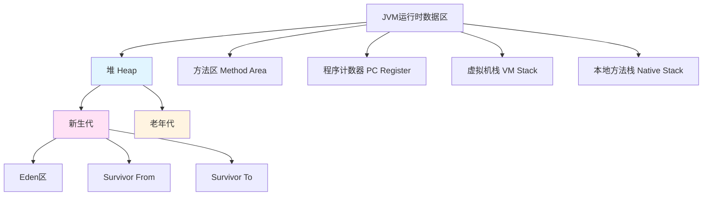

# JVM性能调优

## 学习目标

完成本章后，你将能够：
- 理解JVM内存结构和垃圾回收机制
- 掌握JVM参数调优方法
- 学会使用工具进行性能分析
- 解决常见的内存泄漏和性能问题
- 掌握生产环境JVM调优最佳实践

**预计学习时间**：8小时
**难度**：⭐⭐⭐ 高级
**前置知识**：熟悉Java基础

## JVM内存结构

### JVM运行时数据区



### 内存结构详解

```java
/**
 * JVM内存区域示例
 */
public class JVMMemoryDemo {

    // 1. 堆内存 - 存储对象实例
    private Object object = new Object(); // 存放在堆

    // 2. 方法区 - 类信息、常量、静态变量
    private static final String CONSTANT = "常量"; // 方法区
    private static int counter = 0; // 方法区

    // 3. 虚拟机栈 - 存储局部变量、方法参数
    public void method() {
        int localVariable = 100; // 虚拟机栈
        Object localObject = new Object(); // 引用在栈，对象在堆

        recursiveMethod(0);
    }

    // 递归调用演示栈帧
    public void recursiveMethod(int depth) {
        if (depth > 1000) {
            return; // 防止栈溢出
        }
        int localVar = depth; // 每次调用都会创建新的栈帧
        recursiveMethod(depth + 1);
    }
}
```

### JVM参数配置

```bash
# JVM参数配置示例

1. 内存相关参数
-Xms4g              # 初始堆大小 4GB
-Xmx4g              # 最大堆大小 4GB（建议与-Xms相同）
-Xmn1.5g            # 新生代大小 1.5GB
-XX:MetaspaceSize=256m     # 元空间初始大小
-XX:MaxMetaspaceSize=256m  # 元空间最大大小
-XX:SurvivorRatio=8        # Eden:S0:S1 = 8:1:1

2. 垃圾回收器选择
# Serial GC（单线程，适合小应用）
-XX:+UseSerialGC

# Parallel GC（多线程，适合吞吐量优先）
-XX:+UseParallelGC

# G1 GC（服务器端推荐，平衡吞吐量和延迟）
-XX:+UseG1GC
-XX:MaxGCPauseMillis=200

# ZGC（Java 15+，低延迟）
-XX:+UseZGC

3. GC日志
-Xlog:gc*:file=/path/to/gc.log:time,tags:filecount=10,filesize=100m

4. 性能调优
-XX:+UseG1GC                           # 使用G1收集器
-XX:MaxGCPauseMillis=200                # 最大GC停顿时间
-XX:G1HeapRegionSize=16m                # G1区域大小
-XX:InitiatingHeapOccupancyPercent=45   # 触发并发标记的堆占用比例

5. 其他优化参数
-XX:+UseStringDeduplication            # 字符串去重
-XX:+OptimizeStringConcat              # 优化字符串拼接
-XX:+UseCompressedOops                 # 压缩普通对象指针
-XX:+UseCompressedClassPointers         # 压缩类指针
```

## 垃圾回收机制

### 对象生命周期

```java
/**
 * 对象生命周期演示
 */
public class ObjectLifecycle {

    public void demonstrateLifecycle() {
        // 1. 对象创建 - 分配在Eden区
        byte[] edenObject = new byte[1 * 1024 * 1024]; // 1MB

        // 2. 对象晋升
        // 经过多次Minor GC后，对象仍然存活，晋升到老年代
        byte[] oldObject = new byte[10 * 1024 * 1024]; // 10MB，直接进老年代

        // 3. 对象回收
        // 对象不再被引用，等待GC回收
        edenObject = null; // 解除引用
    }
}
```

### GC类型与触发条件

```java
/**
 * GC触发演示
 */
public class GCTriggerDemo {

    // Minor GC触发条件：Eden区不足
    public void minorGCTrigger() {
        List<byte[]> objects = new ArrayList<>();

        // 不断创建对象，填满Eden区
        for (int i = 0; i < 1000; i++) {
            objects.add(new byte[1024 * 1024]); // 1MB
        }

        // 当Eden区满时，触发Minor GC
        // 存活对象复制到Survivor区，年龄+1
    }

    // Major GC/Full GC触发条件
    public void majorGCTrigger() {
        // 1. 老年代空间不足
        // 2. 方法区空间不足
        // 3. 显式调用System.gc()
        System.gc(); // 建议JVM进行GC（不保证立即执行）

        // 4. Minor GC晋升对象大小超过Survivor区
        List<byte[]> objects = new ArrayList<>();
        for (int i = 0; i < 10000; i++) {
            objects.add(new byte[2 * 1024 * 1024]); // 2MB
        }
    }
}
```

### G1 GC工作原理

```java
/**
 * G1 GC示例配置与优化
 */
public class G1GCOptimization {

    /*
     * G1 GC特点：
     * 1. 基于Region的内存布局
     * 2. 可预测的停顿时间模型
     * 3. 并发标记
     * 4. 增量回收
     */

    public void configureG1GC() {
        /*
         * 推荐配置：
         *
         * -XX:+UseG1GC
         * -XX:MaxGCPauseMillis=200          # 目标最大停顿时间200ms
         * -XX:G1HeapRegionSize=16m          # Region大小（2MB-32MB，2的幂次方）
         * -XX:InitiatingHeapOccupancyPercent=45  # 并发标记的堆占用阈值
         * -XX:G1ReservePercent=10           # 保留内存比例
         * -XX:G1MixedGCCountTarget=8        # 混合GC目标次数
         */
    }

    /**
     * 优化建议：
     * 1. -XX:MaxGCPauseMillis 不宜设置过小（建议100-300ms）
     * 2. -XX:InitiatingHeapOccupancyPercent 不宜过大（建议40-50%）
     * 3. -XX:G1HeapRegionSize 根据堆大小设置（堆大小/2048）
     * 4. 监控Mixed GC频率，过高说明Survivor区太小
     */
}
```

## JVM性能分析工具

### jmap - 堆内存分析

```bash
1. 查看堆内存使用情况
jmap -heap <pid>

# 输出示例：
# Heap Configuration:
#    MinHeapFreeRatio         = 40
#    MaxHeapFreeRatio         = 70
#    MaxHeapSize              = 4294967296 (4096.0MB)
#    NewSize                  = 157286400 (150.0MB)
#    MaxNewSize               = 157286400 (150.0MB)
#    OldSize                  = 34603008 (33.0MB)
#    NewRatio                 = 2
#    SurvivorRatio            = 8

2. 导出堆转储文件
jmap -dump:format=b,file=heap.hprof <pid>

3. 查看类统计信息
jmap -histo:live <pid> | head -20

# 输出示例：
#  num     #instances         #bytes  class name
#    1:          5000        800000  byte[]
#    2:          3000        720000  com.example.User
#    3:          2000        480000  java.lang.String
```

### jstack - 线程堆栈分析

```bash
1. 查看线程堆栈
jstack <pid>

2. 查看死锁信息
jstack -l <pid>

3. 定期采样线程状态
while true; do
    echo "=== $(date) ===" >> thread-dump.log
    jstack <pid> >> thread-dump.log
    sleep 5
done

4. 分析线程状态
jstack <pid> | grep "java.lang.Thread.State" | sort | uniq -c

# 输出示例：
#      10 RUNNABLE
#       5 WAITING
#       3 TIMED_WAITING
#       2 BLOCKED
```

### jstat - JVM统计信息

```bash
# 1. 查看GC统计（每秒更新一次）
jstat -gc <pid> 1s

# 输出示例：
#  S0C    S1C    S0U    S1U      EC       EU         OC       OU       MC     MU    CCSC   CCSU   YGC     YGCT    FGC    FGCT     GCT
#-512.0  512.0    0.0   256.0   2048.0    1024.0    4096.0    2048.0   256.0  128.0  512.0   384.0     10    0.250    2    0.150    0.400

# 字段说明：
# S0C/S1C: Survivor 0/1 区容量
# S0U/S1U: Survivor 0/1 区使用量
# EC: Eden区容量
# EU: Eden区使用量
# OC: 老年代容量
# OU: 老年代使用量
# MC: 元空间容量
# MU: 元空间使用量
# YGC: Young GC次数
# YGCT: Young GC总时间
# FGC: Full GC次数
# FGCT: Full GC总时间
# GCT: 总GC时间

2. 查看编译统计
jstat -compiler <pid>

3. 查看类加载统计
jstat -class <pid>
```

### VisualVM - 可视化监控

```java
/**
 * VisualVM监控示例
 */
public class VisualJMXDemo {

    /**
     * 启动应用时添加JMX参数：
     *
     * -Dcom.sun.management.jmxremote
     * -Dcom.sun.management.jmxremote.port=9010
     * -Dcom.sun.management.jmxremote.authenticate=false
     * -Dcom.sun.management.jmxremote.ssl=false
     */

    // MBean示例
    public interface PerformanceMBean {
        int getThroughput();
        void setThroughput(int throughput);
        double getAverageResponseTime();
    }

    public class Performance implements PerformanceMBean {

        private AtomicInteger throughput = new AtomicInteger(0);
        private AtomicLong totalResponseTime = new AtomicLong(0);
        private AtomicInteger requestCount = new AtomicInteger(0);

        @Override
        public int getThroughput() {
            return throughput.get();
        }

        @Override
        public void setThroughput(int throughput) {
            this.throughput.set(throughput);
        }

        @Override
        public double getAverageResponseTime() {
            long count = requestCount.get();
            return count > 0 ? (double) totalResponseTime.get() / count : 0;
        }

        public void recordRequest(long responseTime) {
            requestCount.incrementAndGet();
            totalResponseTime.addAndGet(responseTime);
        }
    }
}
```

## 性能调优实践

### 内存泄漏排查

```java
/**
 * 内存泄漏示例与修复
 */
public class MemoryLeakDemo {

    // ❌ 内存泄漏示例
    static class MemoryLeakExample {
        private static final List<byte[]> CACHE = new ArrayList<>();

        public void addToCache(byte[] data) {
            CACHE.add(data); // 无限增长，导致内存泄漏
        }
    }

    // ✅ 正确使用缓存
    static class CorrectCacheExample {
        // 使用LRU缓存
        private static final int MAX_SIZE = 1000;
        private static final Map<String, byte[]> CACHE =
            new LinkedHashMap<String, byte[]>(MAX_SIZE, 0.75f, true) {
                @Override
                protected boolean removeEldestEntry(Map.Entry eldest) {
                    return size() > MAX_SIZE;
                }
            };

        public void addToCache(String key, byte[] data) {
            CACHE.put(key, data);
        }
    }

    // ❌ 连接未关闭
    static class ConnectionLeak {
        public void queryData() {
            Connection conn = getConnection();
            Statement stmt = null;
            ResultSet rs = null;

            try {
                stmt = conn.createStatement();
                rs = stmt.executeQuery("SELECT * FROM users");
                // 处理结果
            } catch (SQLException e) {
                e.printStackTrace();
            }
            // 忘记关闭连接
        }
    }

    // ✅ 正确关闭连接
    static class CorrectConnection {
        public void queryData() {
            try (Connection conn = getConnection();
                 Statement stmt = conn.createStatement();
                 ResultSet rs = stmt.executeQuery("SELECT * FROM users")) {

                // 处理结果

            } catch (SQLException e) {
                e.printStackTrace();
            }
            // try-with-resources自动关闭连接
        }
    }

    private static Connection getConnection() {
        return null;
    }
}
```

### 性能优化技巧

```java
/**
 * JVM性能优化技巧
 */
public class PerformanceOptimization {

    // 1. 避免创建不必要的对象
    public void avoidUnnecessaryObjects() {
        // ❌ 不好的做法
        String s = new String("hello"); // 创建了两个对象

        // ✅ 好的做法
        String s2 = "hello"; // 只创建一个对象

        // ❌ 不好的做法
        for (int i = 0; i < 1000; i++) {
            List<String> list = new ArrayList<>();
            // 使用list
        }

        // ✅ 好的做法
        List<String> list = new ArrayList<>();
        for (int i = 0; i < 1000; i++) {
            list.clear();
            // 使用list
        }
    }

    // 2. 使用对象池
    public class ObjectPoolExample {

        private final GenericObjectPool<Connection> connectionPool;

        public ObjectPoolExample() {
            ConnectionFactory factory = new ConnectionFactory() {
                @Override
                public Connection create() {
                    return createConnection();
                }
            };

            GenericObjectPoolConfig<Connection> config = new GenericObjectPoolConfig<>();
            config.setMaxTotal(10);
            config.setMaxIdle(5);
            config.setMinIdle(2);

            connectionPool = new GenericObjectPool<>(factory, config);
        }

        public Connection getConnection() throws Exception {
            return connectionPool.borrowObject();
        }

        public void returnConnection(Connection conn) {
            connectionPool.returnObject(conn);
        }
    }

    // 3. 优化字符串操作
    public void stringOptimization() {
        // ❌ 不好的做法
        String result = "";
        for (int i = 0; i < 1000; i++) {
            result += i; // 每次都创建新对象
        }

        // ✅ 好的做法
        StringBuilder sb = new StringBuilder();
        for (int i = 0; i < 1000; i++) {
            sb.append(i);
        }
        String result2 = sb.toString();

        // ✅ 使用String.join（Java 8+）
        String[] parts = {"a", "b", "c"};
        String joined = String.join(",", parts);
    }

    // 4. 避免装箱/拆箱
    public void avoidBoxingUnboxing() {
        // ❌ 不好的做法
        Long sum = 0L;
        for (long i = 0; i < 1000; i++) {
            sum += i; // 每次都装箱/拆箱
        }

        // ✅ 好的做法
        long sum2 = 0L;
        for (long i = 0; i < 1000; i++) {
            sum2 += i;
        }
    }

    // 5. 使用并发集合
    public void useConcurrentCollections() {
        // ❌ 不好的做法
        Map<String, String> map = new HashMap<>();
        // 多线程下需要手动同步

        // ✅ 好的做法
        Map<String, String> concurrentMap = new ConcurrentHashMap<>();
        // 线程安全，性能更好
    }
}
```

## 生产环境调优实战

### 大堆内存配置

```bash
# 8GB堆内存配置示例
JAVA_OPTS="
-Xms8g
-Xmx8g
-Xmn3g
-XX:MetaspaceSize=256m
-XX:MaxMetaspaceSize=256m
-XX:+UseG1GC
-XX:MaxGCPauseMillis=200
-XX:G1HeapRegionSize=16m
-XX:InitiatingHeapOccupancyPercent=45
-XX:+UseG1GC
-XX:MaxGCPauseMillis=200
-XX:+HeapDumpOnOutOfMemoryError
-XX:HeapDumpPath=/path/to/dump
-Xlog:gc*:file=/path/to/gc.log:time,tags:filecount=10,filesize=100m
"
```

### 低延迟配置

```bash
# 低延迟应用配置（如交易系统）
JAVA_OPTS="
-Xms4g
-Xmx4g
-Xms4g
-Xmx4g
-XX:+UseZGC
-XX:+AlwaysPreTouch
-XX:+DisableExplicitGC
-XX:+ParallelRefProcEnabled
-XX:+UseStringDeduplication
-XX:MaxGCPauseMillis=10
"
```

### 高吞吐量配置

```bash
# 批处理应用配置
JAVA_OPTS="
-Xms8g
-Xmx8g
-Xmn4g
-XX:+UseParallelGC
-XX:ParallelGCThreads=8
-XX:MaxGCPauseMillis=500
"
```

### 监控与告警

```java
/**
 * JVM监控指标
 */
@Component
public class JVMMonitor {

    private final MemoryMXBean memoryMXBean =
        ManagementFactory.getMemoryMXBean();

    private final RuntimeMXBean runtimeMXBean =
        ManagementFactory.getRuntimeMXBean();

    private final GarbageCollectorMXBean gcMXBean =
        ManagementFactory.getGarbageCollectorMXBeans()[0];

    @Scheduled(fixedRate = 60000) // 每分钟检查一次
    public void monitorMemory() {
        MemoryUsage heapUsage = memoryMXBean.getHeapMemoryUsage();

        long used = heapUsage.getUsed();
        long max = heapUsage.getMax();
        double usagePercent = (double) used / max * 100;

        System.out.printf("堆内存使用率: %.2f%%%n", usagePercent);

        if (usagePercent > 80) {
            System.err.println("警告：堆内存使用率过高！");
            // 发送告警
        }
    }

    @Scheduled(fixedRate = 60000)
    public void monitorGC() {
        long gcCount = gcMXBean.getCollectionCount();
        long gcTime = gcMXBean.getCollectionTime();

        System.out.printf("GC次数: %d, GC总时间: %dms%n", gcCount, gcTime);

        // 发送到监控系统
        Metrics.gauge("jvm.gc.count", gcCount);
        Metrics.gauge("jvm.gc.time", gcTime);
    }
}
```

## 常见问题与解决方案

### 1. OutOfMemoryError

```java
/**
 * OOM分析与解决
 */
public class OOMSolution {

    // Java堆空间不足
    public void heapOOM() {
        // 原因：对象太多且无法回收
        // 解决：增加堆内存、检查内存泄漏
        try {
            List<byte[]> list = new ArrayList<>();
            while (true) {
                list.add(new byte[1024 * 1024]);
            }
        } catch (OutOfMemoryError e) {
            // 分析heap dump文件
            // 使用MAT或VisualVM分析
            System.err.println("堆内存溢出：" + e.getMessage());
        }
    }

    // 元空间不足
    public void metaspaceOOM() {
        // 原因：加载的类太多
        // 解决：增加元空间大小
        // -XX:MaxMetaspaceSize=512m
    }

    // 栈溢出
    public void stackOverflow() {
        // 原因：递归调用太深
        // 解决：优化算法、增加栈大小
        // -Xss2m
        try {
            recursive(0);
        } catch (StackOverflowError e) {
            System.err.println("栈溢出：" + e.getMessage());
        }
    }

    private void recursive(int depth) {
        if (depth > Integer.MAX_VALUE) {
            return;
        }
        recursive(depth + 1);
    }
}
```

### 2. GC频繁

```bash
# 问题：Minor GC过于频繁

# 分析：
1. Survivor区太小，对象过早晋升
2. Eden区太小，频繁触发GC

# 解决方案：
# -XX:SurvivorRatio=8          # 调整Survivor比例
# -XX:TargetSurvivorRatio=90   # 目标Survivor使用率
# -XX:MaxTenuringThreshold=15   # 晋升年龄阈值
# -Xmn2g                       # 增加新生代大小

# 问题：Full GC频繁

# 分析：
1. 老年代空间不足
2. 元空间不足
3. 显式调用System.gc()

# 解决方案：
# -Xmx8g                       # 增加最大堆内存
# -XX:MaxMetaspaceSize=512m    # 增加元空间
# -XX:+DisableExplicitGC       # 禁用显式GC
```

### 3. CPU使用率过高

```bash
# 问题：CPU使用率持续100%

# 分析步骤：
1. 使用top -H -p <pid> 查看线程CPU使用率
2. 使用jstack <pid> 导出线程堆栈
3. 找到CPU使用率高的线程
4. 分析线程堆栈，定位问题代码

# 常见原因：
1. 死循环
2. 正则表达式回溯
3. 频繁GC
4. 序列化/反序列化

# 解决方案：
# 优化代码、使用缓存、调整算法
```

## 避坑指南

### 常见误区

**1. 堆内存越大越好**
```
❌ 错误：-Xmx32g（32GB堆内存）
✅ 正确：根据实际应用设置（通常4-8GB足够）

原因：堆内存越大，GC停顿时间越长
```

**2. 忽视GC日志**
```
❌ 错误：生产环境不开启GC日志
✅ 正确：必须开启GC日志用于问题排查

-Xlog:gc*:file=/path/to/gc.log:time,tags
```

**3. 过早优化**
```
❌ 错误：还没遇到问题就开始调优
✅ 正确：先监控发现问题，再有针对性调优
```

**4. 忽视对象生命周期**
```
❌ 错误：不关注对象何时被回收
✅ 正确：理解对象生命周期，避免内存泄漏
```

## 总结

JVM性能调优是一个系统的工程，需要：

1. **理解原理**：掌握JVM内存结构和GC机制
2. **监控工具**：熟练使用jmap、jstack、jstat等工具
3. **数据分析**：根据GC日志、堆转储文件分析问题
4. **调优实践**：根据应用特点选择合适的JVM参数
5. **持续优化**：性能优化是一个持续的过程

**推荐阅读**
- 《深入理解Java虚拟机（第3版）》周志明
- 《Java性能权威指南》Scott Oaks

**练习题**
1. 分析一个OOM案例
2. 调优一个Full GC频繁的应用
3. 使用MAT分析堆转储文件
4. 制定生产环境JVM参数配置

---

**上一章**：[事件驱动架构](./chapter-146) | **返回目录**：[学习路线](./index.md)
