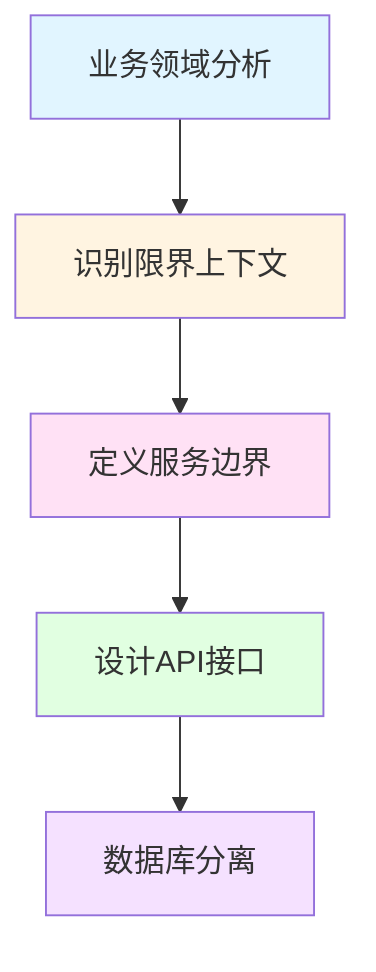
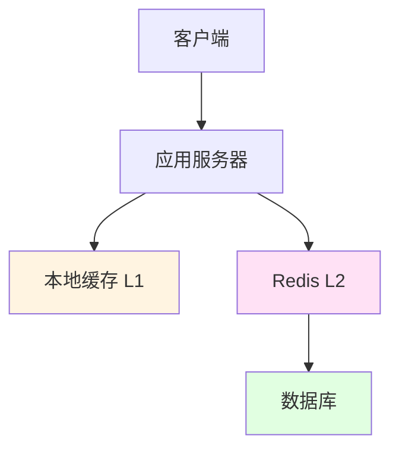
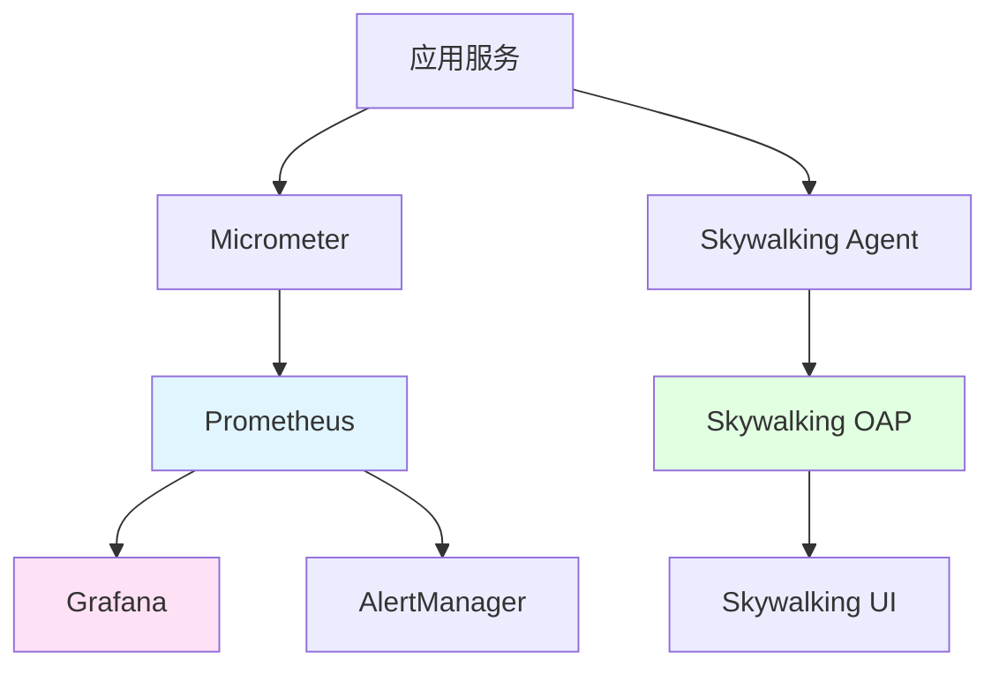
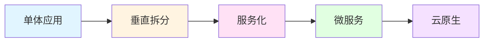

# 企业级架构设计

## 学习目标

完成本章后，你将能够：
- 理解企业级架构设计的核心原则
- 掌握微服务架构的设计方法
- 学会领域驱动设计（DDD）
- 了解分布式架构的最佳实践
- 掌握架构演进的方法论

**预计学习时间**：6小时
**难度**：⭐⭐⭐ 高级
**前置知识**：完成前面所有章节的学习

## 企业级架构概述

### 什么是企业级架构？

企业级架构是指支撑大型企业业务系统的软件架构设计，它需要满足以下特性：

- **高可用性**：系统7×24小时稳定运行
- **高性能**：支撑海量并发访问
- **可扩展性**：业务增长时系统能平滑扩展
- **安全性**：保护数据和系统安全
- **可维护性**：代码易于理解和修改
- **灵活性**：快速响应业务变化

### 架构设计的核心原则

#### SOLID原则

```java
// 单一职责原则 - 每个类只负责一件事
public class UserService {
    // 只负责用户相关逻辑
    public void createUser(User user) {}
    public User getUser(Long id) {}
}

// 开闭原则 - 对扩展开放，对修改关闭
public interface PaymentStrategy {
    void pay(PaymentRequest request);
}

public class AlipayStrategy implements PaymentStrategy {
    @Override
    public void pay(PaymentRequest request) {
        // 支付宝支付逻辑
    }
}

// 依赖倒置原则 - 依赖抽象而非具体实现
public class OrderService {
    private final PaymentStrategy paymentStrategy;

    public OrderService(PaymentStrategy paymentStrategy) {
        this.paymentStrategy = paymentStrategy;
    }
}
```

#### DDD领域驱动设计

```java
// 值对象 - 不可变，没有身份标识
public record Money(
    BigDecimal amount,
    Currency currency
) {
    public Money {
        if (amount.compareTo(BigDecimal.ZERO) < 0) {
            throw new IllegalArgumentException("金额不能为负数");
        }
    }

    public Money add(Money other) {
        return new Money(this.amount.add(other.amount), this.currency);
    }
}

// 实体 - 有唯一标识，有生命周期
@Entity
public class Order {
    @Id
    private Long id;

    private String orderNo;
    private Money totalAmount;
    private OrderStatus status;

    // 领域逻辑
    public void pay() {
        if (this.status != OrderStatus.PENDING) {
            throw new IllegalStateException("订单状态不正确");
        }
        this.status = OrderStatus.PAID;
    }
}

// 聚合根 - 一组相关实体的根
@Entity
public class User {
    @Id
    private Long id;

    private String username;
    private List<Order> orders;

    public void placeOrder(Order order) {
        validateOrder(order);
        this.orders.add(order);
    }
}

// 仓储 - 持久化抽象
public interface OrderRepository extends JpaRepository<Order, Long> {
    Optional<Order> findByOrderNo(String orderNo);
}
```

## 微服务架构设计

### 服务拆分原则



### 电商平台服务拆分

```java
// 用户服务
@Service
public class UserService {
    // 用户注册、登录、信息管理
}

// 商品服务
@Service
public class ProductService {
    // 商品管理、分类、搜索
}

// 订单服务
@Service
public class OrderService {
    // 订单创建、支付、发货
}

// 库存服务
@Service
public class InventoryService {
    // 库存查询、锁定、扣减
}
```

### 服务间通信

#### 同步通信 - OpenFeign

```java
@FeignClient(name = "inventory-service")
public interface InventoryServiceClient {
    @PostMapping("/api/inventory/lock")
    Result<Boolean> lockInventory(@RequestBody LockInventoryRequest request);
}

// 熔断降级
@Component
public class InventoryServiceFallback implements InventoryServiceClient {
    @Override
    public Result<Boolean> lockInventory(LockInventoryRequest request) {
        log.error("库存服务不可用");
        return Result.fail("库存服务暂时不可用");
    }
}
```

#### 异步通信 - RabbitMQ

```java
// 订单创建事件
@Data
@AllArgsConstructor
public class OrderCreatedEvent {
    private Long orderId;
    private String orderNo;
    private Long userId;
}

// 订单服务 - 发送事件
@Service
public class OrderService {
    @Autowired
    private RabbitTemplate rabbitTemplate;

    @Transactional
    public void createOrder(Order order) {
        orderRepository.save(order);

        OrderCreatedEvent event = new OrderCreatedEvent(
            order.getId(),
            order.getOrderNo(),
            order.getUserId()
        );

        rabbitTemplate.convertAndSend(
            "order-exchange",
            "order.created",
            event
        );
    }
}

// 库存服务 - 监听事件
@Component
@Slf4j
public class InventoryEventListener {

    @RabbitListener(queues = "inventory-queue")
    public void handleOrderCreated(OrderCreatedEvent event) {
        inventoryService.lockInventory(
            event.getOrderNo(),
            event.getItems()
        );
    }
}
```

## 高并发架构设计

### 缓存架构



#### 多级缓存实现

```java
@Service
public class ProductService {

    @Autowired
    private ProductRepository productRepository;

    @Autowired
    private RedisTemplate<String, Product> redisTemplate;

    // Caffeine本地缓存
    private final Cache<String, Product> localCache = Caffeine.newBuilder()
        .maximumSize(1000)
        .expireAfterWrite(5, TimeUnit.MINUTES)
        .build();

    public Product getProduct(Long id) {
        String cacheKey = "product:" + id;

        // L1：本地缓存
        Product product = localCache.getIfPresent(cacheKey);
        if (product != null) {
            return product;
        }

        // L2：Redis缓存
        product = redisTemplate.opsForValue().get(cacheKey);
        if (product != null) {
            localCache.put(cacheKey, product);
            return product;
        }

        // L3：数据库
        product = productRepository.findById(id)
            .orElseThrow(() -> new ProductNotFoundException(id));

        // 写入缓存
        redisTemplate.opsForValue().set(cacheKey, product, 30, TimeUnit.MINUTES);
        localCache.put(cacheKey, product);

        return product;
    }
}
```

### 限流架构

```java
// Sentinel限流配置
@Configuration
public class SentinelConfig {

    @PostConstruct
    public void initFlowRules() {
        List<FlowRule> rules = new ArrayList<>();

        FlowRule rule = new FlowRule();
        rule.setResource("createOrder");
        rule.setGrade(RuleConstant.FLOW_GRADE_QPS);
        rule.setCount(100); // 每秒100个请求

        rules.add(rule);
        FlowRuleManager.loadRules(rules);
    }
}

// 使用限流
@RestController
@RequestMapping("/api/orders")
public class OrderController {

    @PostMapping
    @SentinelResource(
        value = "createOrder",
        blockHandler = "handleBlock"
    )
    public Result<Order> createOrder(@RequestBody CreateOrderRequest request) {
        Order order = orderService.createOrder(request);
        return Result.success(order);
    }

    public Result<Order> handleBlock(CreateOrderRequest request,
                                     BlockException exception) {
        return Result.fail(429, "系统繁忙，请稍后再试");
    }
}
```

## 监控与运维

### 监控架构



### Micrometer集成

```java
@Configuration
public class MicrometerConfig {

    @Bean
    public MeterRegistryCustomizer<MeterRegistry> metricsCommonTags() {
        return registry -> registry.config()
            .commonTags("application", "order-service")
            .commonTags("region", System.getenv("REGION"));
    }
}

// 自定义指标
@Component
public class OrderMetrics {

    private final Counter orderCreatedCounter;
    private final Timer orderCreatedTimer;

    public OrderMetrics(MeterRegistry registry) {
        this.orderCreatedCounter = Counter.builder("order.created")
            .description("订单创建数量")
            .register(registry);

        this.orderCreatedTimer = Timer.builder("order.created.duration")
            .description("订单创建耗时")
            .register(registry);
    }

    public void recordOrderCreated() {
        orderCreatedCounter.increment();
    }
}
```

## 架构演进路径



### 单体 → 微服务演进

**阶段1：单体应用**
- 所有功能在一个应用中
- 适合创业初期

**阶段2：垂直拆分**
- 按业务功能拆分
- 独立部署

**阶段3：服务化**
- 引入服务注册发现
- 统一API网关

**阶段4：微服务**
- 服务细粒度拆分
- 容器化部署

**阶段5：云原生**
- Kubernetes编排
- Service Mesh
- Serverless

## 最佳实践

### 1. CAP定理权衡

```
一致性 - Consistency
可用性 - Availability
分区容错性 - Partition Tolerance

在分布式系统中，P是必须的，只能在C和A之间权衡
```

### 2. 数据一致性方案

```java
// 强一致性 - 分布式事务
@GlobalTransactional
public void createOrder(Order order) {
    // Seata保证强一致性
}

// 最终一致性 - 事件驱动
@Service
public class OrderService {
    public void createOrder(Order order) {
        orderRepository.save(order);
        eventPublisher.publish(new OrderCreatedEvent(order));
        // 异步处理，通过重试+补偿保证最终一致性
    }
}
```

### 3. 性能优化清单

```java
// 1. 缓存策略
@Cacheable(value = "user", key = "#id")
public User getUser(Long id) {}

// 2. 异步处理
@Async
public CompletableFuture<Void> sendEmail(User user) {}

// 3. 批量操作
public List<Order> batchCreateOrders(List<Order> orders) {
    return orderRepository.saveAll(orders);
}
```

## 总结

企业级架构设计是一个持续演进的过程：

1. **遵循DDD**：以领域模型为核心
2. **微服务拆分**：合理划分服务边界
3. **高并发处理**：多级缓存、限流降级
4. **监控运维**：全链路监控
5. **持续演进**：根据业务发展优化

**推荐阅读**
- 《领域驱动设计》Eric Evans
- 《微服务架构设计模式》Chris Richardson

**练习题**
1. 设计一个电商系统的微服务架构
2. 实现一个分布式事务场景
3. 设计一个高并发的秒杀系统

---

**上一章**：[JVM性能调优](./chapter-147) | **返回目录**：[学习路线](./index.md)
