# Java中高级面试题总览（2024-2026大厂高频题）

> **更新时间**：2026年2月 | **版本**：v2.0 | **覆盖范围**：阿里、字节、腾讯、京东等一线大厂
>
> 本文档整理了2024-2026年大厂Java中高级岗位的高频面试题，涵盖Java基础、JVM、并发编程、Spring全家桶、微服务、分布式系统、数据库、中间件等核心技术栈。

## 📊 面试题分布统计

根据2024-2025年大厂面试数据统计：

| 技术领域 | 题目数量 | 出现频率 | 难度等级 |
|---------|---------|---------|---------|
| **Java基础** | 35题 | 95% | ⭐⭐ |
| **JVM调优** | 28题 | 90% | ⭐⭐⭐ |
| **并发编程** | 32题 | 92% | ⭐⭐⭐ |
| **Spring框架** | 40题 | 98% | ⭐⭐⭐ |
| **微服务架构** | 35题 | 88% | ⭐⭐⭐⭐ |
| **分布式系统** | 30题 | 85% | ⭐⭐⭐⭐ |
| **数据库优化** | 25题 | 90% | ⭐⭐⭐ |
| **Redis缓存** | 22题 | 88% | ⭐⭐⭐ |
| **消息队列** | 18题 | 75% | ⭐⭐⭐ |
| **系统设计** | 20题 | 80% | ⭐⭐⭐⭐⭐ |

**总计：约285道高频面试题**

---

## 🎯 一、Java基础（35题）

### 1.1 HashMap核心原理

**Q1: HashMap的底层实现原理是什么？**

**参考答案**：

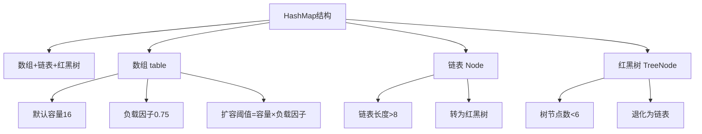

**核心要点**：
- **JDK 1.8**：数组 + 链表 + 红黑树
- **数组初始容量**：16，负载因子0.75
- **链表转红黑树**：链表长度 ≥ 8 且数组长度 ≥ 64
- **红黑树退化为链表**：节点数 ≤ 6
- **扩容时机**：size > capacity * loadFactor
- **扩容机制**：容量翻倍，重新计算所有元素的位置

**Q2: HashMap在多线程环境下会出现什么问题？**

**参考答案**：
1. **JDK 1.7**：链表成环问题（扩容时）
2. **JDK 1.8**：数据丢失、数据覆盖
3. **解决方案**：使用ConcurrentHashMap或Collections.synchronizedMap()

### 1.2 ConcurrentHashMap原理

**Q3: ConcurrentHashMap的实现原理（JDK 1.7 vs 1.8）？**

**参考答案**：

| 特性 | JDK 1.7 | JDK 1.8 |
|-----|---------|---------|
| **底层结构** | Segment数组 + HashEntry数组 + 链表 | Node数组 + 链表 + 红黑树 |
| **锁粒度** | Segment（多个HashEntry） | 单个Node（头节点） |
| **并发度** | 默认16 | 理论上数组长度 |
| **查询操作** | 需要加锁（ReentrantLock） | 无锁（volatile + CAS） |
| **size计算** |累加segments| 赋值CounterCell + baseCount |

**JDK 1.8 核心优化**：
- **CAS + synchronized**替代ReentrantLock
- **头节点锁**：只锁链表/红黑树的头节点
- **无锁读**：Node的val和next都用volatile修饰

**Q4: ConcurrentHashMap如何保证可见性？**

**参考答案**：
1. **volatile修饰**：Node的val和next属性
2. **内存屏障**：CAS操作自带内存屏障
3. **synchronized**：解锁时会刷新到主内存

### 1.3 Java 17-21新特性

**Q5: Java 21虚拟线程是什么？解决了什么问题？**

**参考答案**：

```java
// 传统线程池模型
ExecutorService executor = Executors.newFixedThreadPool(200);
// 问题：线程数量受限，上下文切换开销大

// 虚拟线程（Java 21）
ExecutorService executor = Executors.newVirtualThreadPerTaskExecutor();
// 优势：轻量级，百万级并发，几乎无上下文切换开销
```

**核心特点**：
- **轻量级**：虚拟线程占用的内存极小（几KB）
- **数量无限**：可创建百万级虚拟线程
- **调度机制**：由JVM调度，而非OS
- **阻塞成本**：阻塞时自动释放物理线程

**适用场景**：
- 高并发IO密集型任务
- Web服务器（如Tomcat、Netty）
- 微服务调用

**Q6: Record类的使用场景和限制？**

**参考答案**：

```java
// 传统写法
class Point {
    private final int x;
    private final int y;
    // 构造器、getter、equals、hashCode、toString...
}

// Record写法（Java 14+）
record Point(int x, int y) {}
```

**特点**：
- 不可变数据载体
- 自动生成构造器、getter、equals、hashCode、toString
- 可实现接口，但不能继承其他类
- 不能声明实例字段（静态字段可以）

**Q7: String Templates（字符串模板）有什么优势？**

**参考答案**：

```java
// Java 21之前
String message = "Hello, " + name + "! Today is " + dayOfWeek;
String formatted = String.format("Hello, %s! Today is %s", name, dayOfWeek);

// Java 21 String Templates
String message = STR."Hello, \{name}! Today is \{dayOfWeek}";
```

**优势**：
- 更简洁、更安全
- 支持多行字符串
- 可格式化（FMT）、可处理SQL（SQL）等

---

## 🔧 二、JVM调优（28题）

### 2.1 内存模型

**Q8: JVM内存结构包含哪些部分？**

**参考答案**：

```
┌─────────────────────────────────────┐
│           JVM内存结构                │
├─────────────────────────────────────┤
│  程序计数器（Program Counter）        │  线程私有
│  虚拟机栈（VM Stack）                │  线程私有
│  本地方法栈（Native Method Stack）   │  线程私有
│  堆（Heap）                         │  线程共享
│  方法区（Method Area）              │  线程共享
└─────────────────────────────────────┘
```

**Q9: 堆内存划分（新生代、老年代）及垃圾回收过程？**

**参考答案**：

```
堆内存划分：
┌─────────────────────────────────────┐
│  Eden区 (8/10)                      │  新对象
│  Survivor S0 (1/10)                 │  存活一次GC
│  Survivor S1 (1/10)                 │  存活一次GC
│  老年代（Old Gen）                   │  长期存活对象
└─────────────────────────────────────┘

Minor GC过程：
1. 新对象分配在Eden区
2. Eden区满后触发Minor GC
3. 存活对象复制到S0，清空Eden
4. 下次GC：Eden+S0 → S1
5. 对象年龄达到15（默认）进入老年代
```

### 2.2 垃圾回收器

**Q10: G1垃圾回收器的工作原理和优势？**

**参考答案**：

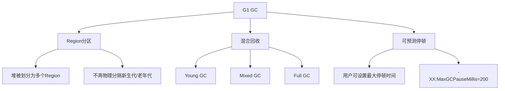

**G1 vs CMS**：

| 特性 | CMS | G1 |
|-----|-----|-----|
| **内存布局** | 物理隔离 | Region分区 |
| **碎片问题** | 有碎片 | 整理合并 |
| **停顿时间** | 不可预测 | 可预测 |
| **适用场景** | 小堆 | 大堆（>6GB） |

**Q11: ZGC（Z Garbage Collector）的特点？**

**参考答案**：
- **并发收集**：几乎全程并发，STW时间<10ms
- **Region布局**：类似G1，但不区分新生代/老年代
- **染色指针**：使用指针的高位标记对象状态
- **读屏障**：通过读屏障处理指针状态
- **适用场景**：超大堆（TB级别）、低延迟要求

**Q12: 如何进行JVM调优？**

**参考答案**：

**生产环境常用参数**：

```bash
# 堆内存设置
-Xms4g -Xmx4g                          # 初始堆和最大堆相等，避免动态扩容
-Xmn2g                                 # 年轻代大小
-XX:MetaspaceSize=256m                 # 元空间初始大小
-XX:MaxMetaspaceSize=256m              # 元空间最大大小

# 垃圾回收器（Java 21）
-XX:+UseZGC                            # 使用ZGC（推荐）
-XX:+UseG1GC                           # 或使用G1

# GC日志
-Xlog:gc*:file=gc.log:time,uptime:filecount=5,filesize=10m

# 性能优化
-XX:+AlwaysPreTouch                    # 预分配内存页
-XX:+UseStringDeduplication            # 字符串去重（G1）
```

**调优步骤**：
1. **监控分析**：使用VisualVM、Arthas、Prometheus
2. **内存泄漏排查**：jmap、jhat、MAT
3. **GC日志分析**：GCViewer
4. **参数调整**：逐步调整并验证

### 2.3 类加载机制

**Q13: Java类加载的过程和双亲委派模型？**

**参考答案**：

```
类加载过程：
加载 → 验证 → 准备 → 解析 → 初始化

双亲委派模型：
启动类加载器（Bootstrap ClassLoader）
    ↓
扩展类加载器（Extension ClassLoader）
    ↓
应用程序类加载器（Application ClassLoader）
    ↓
自定义类加载器
```

**为什么要双亲委派？**
- **安全性**：防止核心类被篡改（如java.lang.String）
- **避免重复加载**：父加载器加载过的类不再重复加载

**Q14: 如何打破双亲委派？**

**参考答案**：
1. **自定义类加载器**：重写loadClass()
2. **线程上下文类加载器**：如Spring、Tomcat
3. **OSGi**：模块化加载，可热部署

**示例**：Tomcat类加载机制
- CommonClassLoader：加载共享类
- WebAppClassLoader：各个Web应用隔离
- 打破双亲委派：优先加载Web应用的类

---

## ⚙️ 三、并发编程（32题）

### 3.1 线程池

**Q15: 线程池的核心参数及工作原理？**

**参考答案**：

```java
ThreadPoolExecutor executor = new ThreadPoolExecutor(
    5,                      // corePoolSize: 核心线程数
    10,                     // maximumPoolSize: 最大线程数
    60L, TimeUnit.SECONDS,  // keepAliveTime: 非核心线程空闲存活时间
    new ArrayBlockingQueue<>(100),  // workQueue: 任务队列
    new ThreadFactory() { ... },     // threadFactory: 线程工厂
    new ThreadPoolExecutor.CallerRunsPolicy()  // handler: 拒绝策略
);
```

**工作流程**：

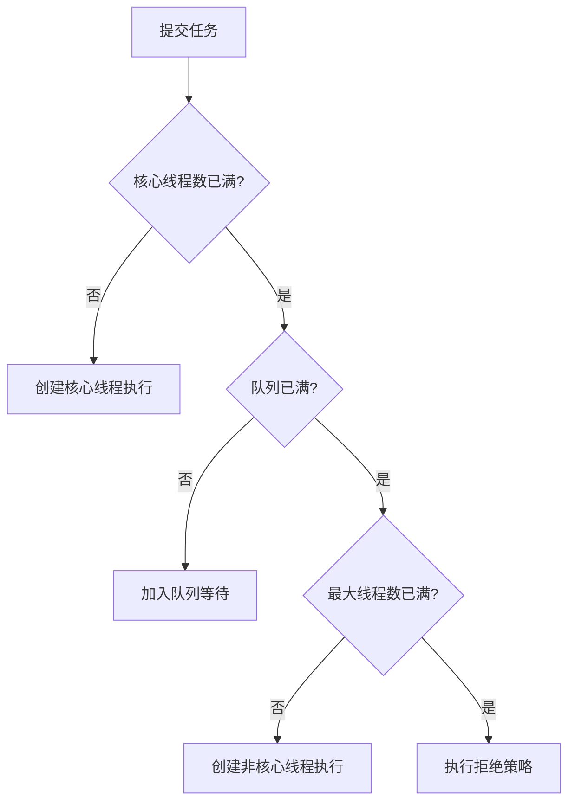

**拒绝策略**：
- `AbortPolicy`（默认）：抛异常
- `CallerRunsPolicy`：调用者执行
- `DiscardPolicy`：直接丢弃
- `DiscardOldestPolicy`：丢弃队列最老的任务

**Q16: 如何合理设置线程池参数？**

**参考答案**：

**CPU密集型任务**：
```java
int n = Runtime.getRuntime().availableProcessors();
executor = new ThreadPoolExecutor(
    n + 1,                  // 核心线程数 = CPU核数 + 1
    n + 1,
    0L, TimeUnit.MILLISECONDS,
    new LinkedBlockingQueue<Runnable>()
);
```

**IO密集型任务**：
```java
int n = Runtime.getRuntime().availableProcessors();
executor = new ThreadPoolExecutor(
    2 * n,                  // 核心线程数 = 2 * CPU核数
    2 * n + 50,
    60L, TimeUnit.SECONDS,
    new LinkedBlockingQueue<>(1000)
);
```

### 3.2 锁机制

**Q17: synchronized和ReentrantLock的区别？**

**参考答案**：

| 特性 | synchronized | ReentrantLock |
|-----|--------------|---------------|
| **锁类型** | 悲观锁、隐式锁 | 悲观锁、显式锁 |
| **使用方式** | 关键字 | API调用 |
| **公平性** | 非公平锁 | 可选公平/非公平 |
| **条件变量** | wait/notify | Condition支持多个条件 |
| **可中断** | 不可中断 | lockInterruptibly()可中断 |
| **锁超时** | 不支持 | tryLock()支持 |
| **性能** | JDK 1.6后优化接近 | 略优 |

**Q18: AQS（AbstractQueuedSynchronizer）原理？**

**参考答案**：

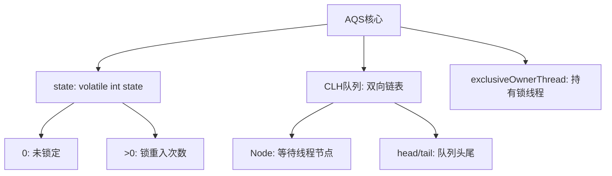

**核心原理**：
1. **state变量**：0表示未锁定，>0表示重入次数
2. **CLH队列**：等待线程的双向队列
3. **CAS+volatile**：保证原子性和可见性

**ReentrantLock基于AQS实现**：
- `lock()`：CAS尝试获取锁，失败则加入队列
- `unlock()`：释放锁，state减1，唤醒队列头节点

### 3.3 并发工具类

**Q19: CountDownLatch、CyclicBarrier、Semaphore的区别？**

**参考答案**：

| 工具类 | 用途 | 特点 | 使用场景 |
|-------|------|------|---------|
| **CountDownLatch** | 等待多个线程完成 | 计数器不可重置 | 等待多个服务启动完成 |
| **CyclicBarrier** | 等待多个线程到达屏障 | 可重置、可回调 | 多线程计算数据汇总 |
| **Semaphore** | 限制并发数量 | 获取/释放许可证 | 限流、数据库连接池 |

**代码示例**：

```java
// CountDownLatch: 等待3个线程完成
CountDownLatch latch = new CountDownLatch(3);
for (int i = 0; i < 3; i++) {
    new Thread(() -> {
        try {
            // 执行任务
        } finally {
            latch.countDown();
        }
    }).start();
}
latch.await();  // 主线程等待

// CyclicBarrier: 3个线程到达屏障后执行回调
CyclicBarrier barrier = new CyclicBarrier(3, () -> {
    System.out.println("所有线程到达屏障，开始汇总");
});

// Semaphore: 限制5个并发
Semaphore semaphore = new Semaphore(5);
semaphore.acquire();  // 获取许可证
try {
    // 执行任务
} finally {
    semaphore.release();  // 释放许可证
}
```

**Q20: ThreadLocal的原理和内存泄漏问题？**

**参考答案**：

**原理**：
```java
public class ThreadLocal<T> {
    // 每个Thread维护一个ThreadLocalMap
    // key: ThreadLocal对象（弱引用）
    // value: 线程的变量副本
}
```

**内存泄漏原因**：
1. **ThreadLocalMap的key是弱引用**：GC时会被回收
2. **value是强引用**：如果不手动remove()，会导致内存泄漏
3. **线程池场景**：线程复用，value一直存在

**解决方案**：
```java
try {
    threadLocal.set(value);
    // 使用
} finally {
    threadLocal.remove();  // 必须手动清理
}
```

---

## 🌱 四、Spring框架（40题）

### 4.1 IOC容器

**Q21: Spring IOC的原理和实现机制？**

**参考答案**：

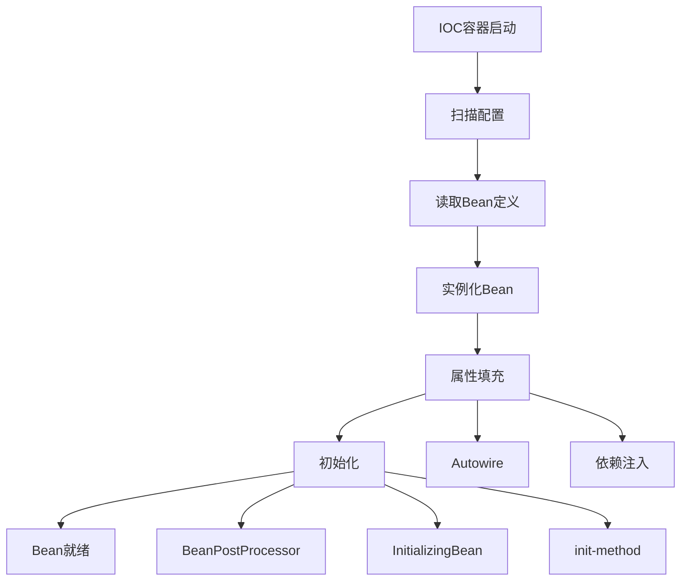

**核心接口**：
- `BeanFactory`：基础容器，延迟加载
- `ApplicationContext`：扩展容器，立即加载
- `BeanDefinition`：Bean定义信息
- `BeanPostProcessor`：Bean后置处理器

**Q22: Spring如何解决循环依赖？**

**参考答案**：

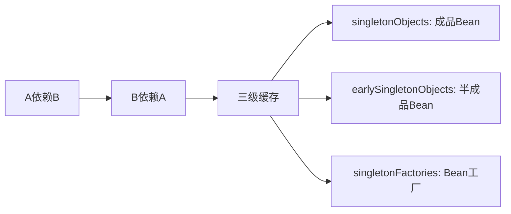

**三级缓存机制**：
1. **一级缓存**：`singletonObjects`，存放完全初始化的Bean
2. **二级缓存**：`earlySingletonObjects`，存放提前暴露的Bean
3. **三级缓存**：`singletonFactories`，存放Bean工厂

**流程**：
1. A创建时，先将工厂放入三级缓存
2. A注入B时触发B创建
3. B注入A时，从三级缓存获取A的早期引用
4. B初始化完成，A继续初始化

**构造器循环依赖无法解决**：抛出BeanCurrentlyInCreationException

### 4.2 AOP原理

**Q23: Spring AOP的实现原理？**

**参考答案**：

**两种实现方式**：

| 方式 | 适用场景 | 实现原理 |
|-----|---------|---------|
| **JDK动态代理** | 目标类实现了接口 | 反射+Proxy |
| **CGLIB代理** | 目标类未实现接口 | 字节码生成+继承 |

**JDK动态代理示例**：
```java
// JDK动态代理
MyInterface proxy = (MyInterface) Proxy.newProxyInstance(
    target.getClass().getClassLoader(),
    target.getClass().getInterfaces(),
    new InvocationHandler() {
        @Override
        public Object invoke(Object proxy, Method method, Object[] args) {
            // 前置通知
            Object result = method.invoke(target, args);
            // 后置通知
            return result;
        }
    }
);
```

**CGLIB代理**：
```java
// CGLIB：生成目标类的子类
Enhancer enhancer = new Enhancer();
enhancer.setSuperclass(target.getClass());
enhancer.setCallback(new MethodInterceptor() {
    @Override
    public Object intercept(Object obj, Method method, Object[] args, MethodProxy proxy) {
        // 前置通知
        Object result = proxy.invokeSuper(obj, args);
        // 后置通知
        return result;
    }
});
```

**Q24: @Transactional失效的场景？**

**参考答案**：

1. **方法非public**：@Transactional只对public方法有效
2. **同类调用**：`this.methodB()`绕过了代理
3. **异常处理不当**：try-catch吞掉异常
4. **事务传播机制错误**：如REQUIRES_NEW嵌套
5. **数据库引擎不支持**：如MySQL的MyISAM

**解决方案**：
```java
// 问题代码
@Service
public class OrderService {
    public void methodA() {
        this.methodB();  // ❌ @Transactional失效
    }

    @Transactional
    public void methodB() { }
}

// 解决方案1：注入自己
@Service
public class OrderService {
    @Autowired
    private OrderService self;

    public void methodA() {
        self.methodB();  // ✅
    }
}

// 解决方案2：AopContext
@Service
public class OrderService {
    public void methodA() {
        ((OrderService) AopContext.currentProxy()).methodB();  // ✅
    }
}
```

### 4.3 Spring Boot原理

**Q25: Spring Boot自动装配原理？**

**参考答案**：

```mermaid
graph TD
    A[@SpringBootApplication] --> B[@EnableAutoConfiguration]
    B --> C[AutoConfigurationImportSelector]
    C --> D[读取META-INF/spring.factories]
    D --> E[加载自动配置类]
    E --> F[@Conditional注解判断]
    F --> G[注册Bean]
```

**核心步骤**：
1. **@SpringBootApplication**：复合注解
2. **@EnableAutoConfiguration**：开启自动配置
3. **AutoConfigurationImportSelector**：导入配置类
4. **spring.factories**：配置类清单
5. **@Conditional**：条件注解决定是否生效

**@Conditional家族**：
- `@ConditionalOnClass`：类路径存在指定类
- `@ConditionalOnMissingBean`：容器中不存在指定Bean
- `@ConditionalOnProperty`：配置文件属性匹配
- `@ConditionalOnWebApplication`：Web环境

**Q26: Spring Boot启动流程？**

**参考答案**：

```java
SpringApplication.run(Application.class, args)

1. 创建SpringApplication
   - 推断Web应用类型（SERVLET/REACTIVE/NONE）
   - 加载ApplicationContextInitializer
   - 加载ApplicationListener

2. 运行run方法
   - 准备Environment（加载配置文件）
   - 打印Banner
   - 创建ApplicationContext
   - 刷新上下文（refresh）
   - 调用runners（ApplicationRunner/CommandLineRunner）
```

---

## 🏗️ 五、微服务架构（35题）

### 5.1 Nacos注册中心

**Q27: Nacos的服务注册与发现流程？**

**参考答案**：

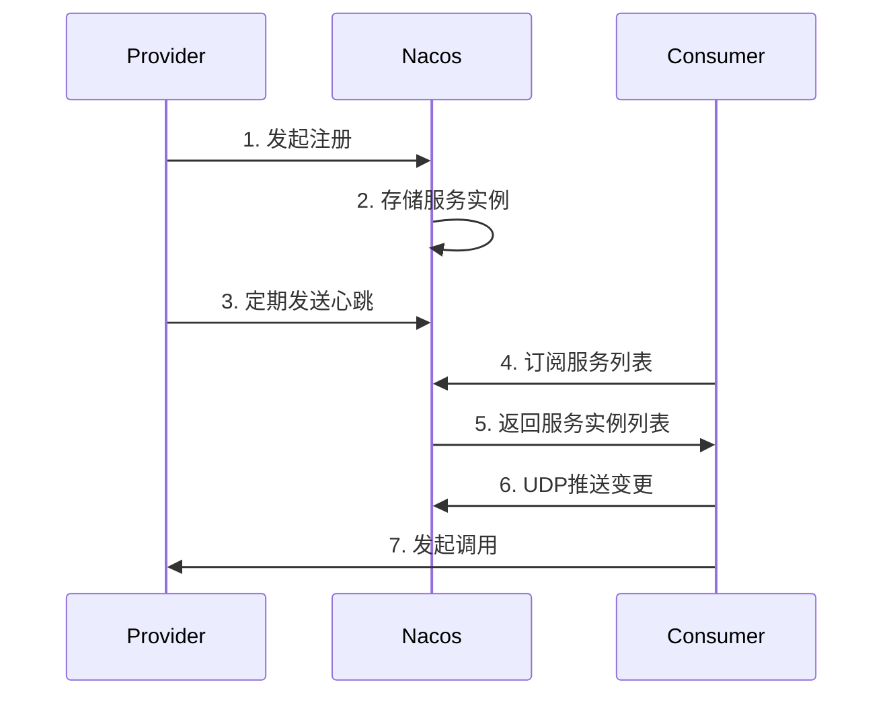

**核心机制**：
- **AP模式**：优先可用性（默认）
- **CP模式**：优先一致性（Raft协议）
- **心跳检测**：5秒心跳，15秒超时剔除
- **健康检查**：TCP/HTTP
- **负载均衡**：权重、同集群优先

**Q28: Nacos配置中心的工作原理？**

**参考答案**：

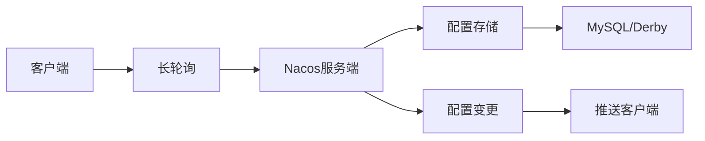

**配置读取优先级**：
1. JVM启动参数（-D）
2. Nacos配置中心（动态）
3. 本地配置文件（application.yml）

### 5.2 Sentinel流控

**Q29: Sentinel的流控规则和熔断降级原理？**

**参考答案**：

**流控规则**：
```java
// QPS限流：超过100则直接拒绝
FlowRule rule = new FlowRule()
    .setResource("orderService")
    .setGrade(RuleConstant.FLOW_GRADE_QPS)
    .setCount(100)
    .setLimitApp("default")
    .asList();
```

**流控策略**：
- **直接拒绝**：抛出FlowException
- **Warm Up**：预热（默认冷启动因子3）
- **匀速排队**：漏桶算法

**熔断降级**：
```java
DegradeRule rule = new DegradeRule()
    .setResource("orderService")
    .setGrade(RuleConstant.DEGRADE_GRADE_RT)  // 平均响应时间
    .setCount(100)  // 超过100ms
    .setTimeWindow(10);  // 熔断10秒

// 异常比例：超过50%则熔断
.setGrade(RuleConstant.DEGRADE_GRADE_EXCEPTION_RATIO)
.setCount(0.5)  // 50%

// 异常数：5个异常则熔断
.setGrade(RuleConstant.DEGRADE_GRADE_EXCEPTION_COUNT)
.setCount(5)
```

**Q30: Sentinel如何实现热点限流？**

**参考答案**：

```java
// 热点参数限流：对订单ID限流
@SentinelResource(
    value = "orderService",
    blockHandler = "handleBlock",
    paramFlowGrade = 1
)
public Order getorder(@HotParam(name = "orderId") Long orderId) {
    return orderMapper.selectById(orderId);
}
```

**热点限流特点**：
- **精确到参数**：对热点参数限流
- **支持令牌桶**：突发流量处理
- **动态调整**：结合实时统计

### 5.3 Seata分布式事务

**Q31: Seata的AT模式原理？**

**参考答案**：

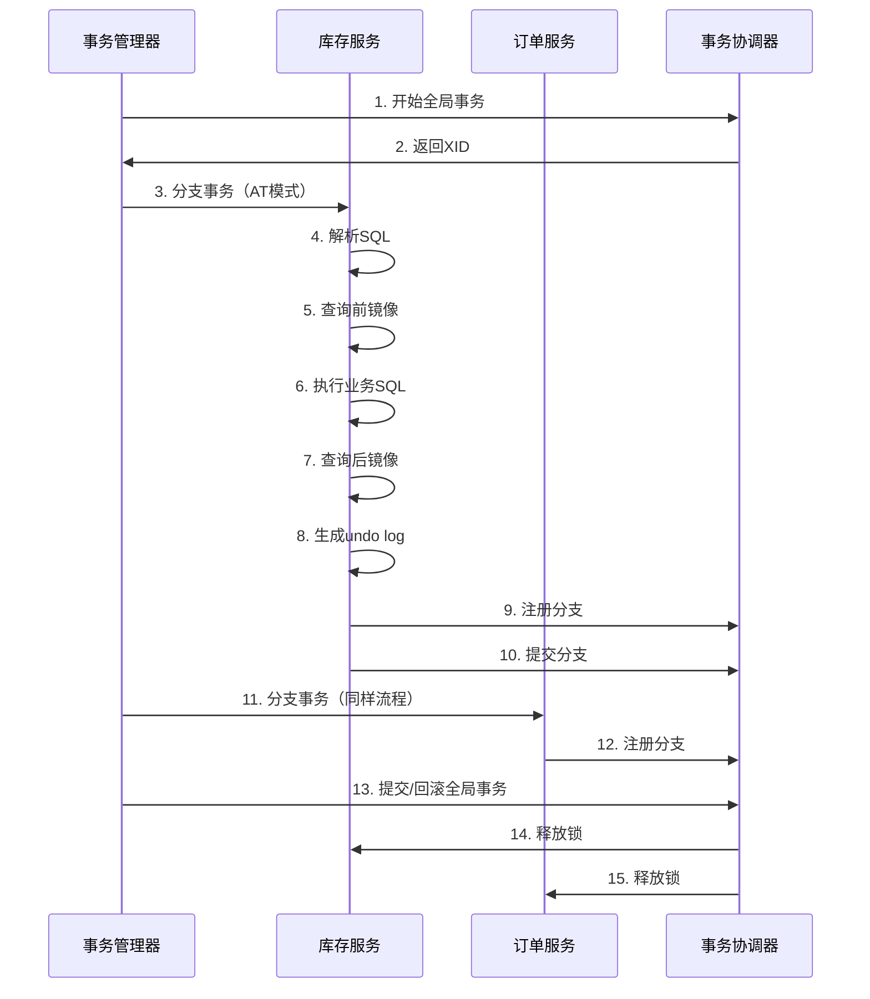

**两阶段提交**：
1. **第一阶段**：
   - 解析SQL语义
   - 查询前镜像（before image）
   - 执行业务SQL
   - 查询后镜像（after image）
   - 生成undo log
   - 提交本地事务（释放本地锁）
   - 上报分支状态

2. **第二阶段**：
   - **提交**：异步删除undo log
   - **回滚**：根据undo log反向补偿

**Q32: Seata的TCC、SAGA模式区别？**

**参考答案**：

| 模式 | 一阶段 | 二阶段提交 | 二阶段回滚 | 适用场景 |
|-----|-------|----------|----------|---------|
| **AT** | 自动 | 自动删除undo log | 自动补偿 | 简单CRUD |
| **TCC** | 手动（Try） | 手动（Confirm） | 手动（Cancel） | 核心业务、强一致 |
| **SAGA** | 手动 | - | 自动补偿 | 长事务、多服务 |

**TCC模板**：
```java
@LocalTCC
public interface OrderService {
    @TwoPhaseBusinessAction(name = "orderTCC", commitMethod = "confirm", rollbackMethod = "cancel")
    boolean createOrder(@BusinessActionContextParameter(paramName = "orderId") Long orderId);

    boolean confirm(BusinessActionContext context);
    boolean cancel(BusinessActionContext context);
}
```

### 5.4 Gateway网关

**Q33: Spring Cloud Gateway的工作原理？**

**参考答案**：

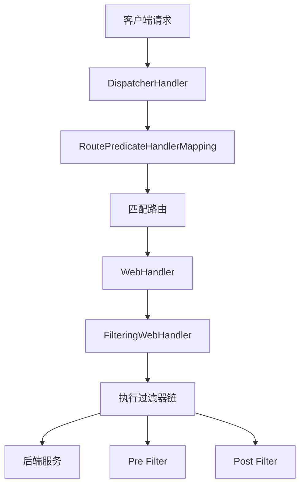

**三大核心**：
1. **Route（路由）**：ID、目标URI、断言、过滤器
2. **Predicate（断言）**：匹配请求条件
3. **Filter（过滤器）**：前置/后置处理

**内置断言工厂**：
```yaml
spring:
  cloud:
    gateway:
      routes:
        - id: order-service
          uri: lb://order-service
          predicates:
            - Path=/api/orders/**
            - Method=GET,POST
            - Header=X-Request-Id, \d+
            - Query=token
            - Before=2026-12-31T23:59:59
```

**Q34: Gateway如何实现全局鉴权？**

**参考答案**：

```java
@Component
public class AuthFilter implements GlobalFilter, Ordered {
    @Override
    public Mono<Void> filter(ServerWebExchange exchange, GatewayFilterChain chain) {
        String token = exchange.getRequest().getHeaders().getFirst("Authorization");

        if (StringUtils.isEmpty(token)) {
            exchange.getResponse().setStatusCode(HttpStatus.UNAUTHORIZED);
            return exchange.getResponse().setComplete();
        }

        // 验证token
        Claims claims = JwtUtil.parseToken(token);
        if (claims == null) {
            exchange.getResponse().setStatusCode(HttpStatus.UNAUTHORIZED);
            return exchange.getResponse().setComplete();
        }

        // 传递用户信息
        ServerHttpRequest request = exchange.getRequest().mutate()
            .header("X-User-Id", claims.getSubject())
            .build();
        return chain.filter(exchange.mutate().request(request).build());
    }

    @Override
    public int getOrder() {
        return -100;  // 优先级最高
    }
}
```

---

## 🌐 六、分布式系统（30题）

### 6.1 分布式锁

**Q35: Redis分布式锁的实现方案？**

**参考答案**：

**方案1：SET NX + EXPIRE**
```java
public boolean tryLock(String key, String value, long expireTime) {
    return Boolean.TRUE.equals(
        redisTemplate.opsForValue()
            .setIfAbsent(key, value, expireTime, TimeUnit.SECONDS)
    );
}

// 释放锁（Lua保证原子性）
public void unlock(String key, String value) {
    String lua = "if redis.call('get', KEYS[1]) == ARGV[1] then " +
                 "return redis.call('del', KEYS[1]) " +
                 "else return 0 end";
    redisTemplate.execute(new DefaultRedisScript<>(lua, Long.class), Collections.singletonList(key), value);
}
```

**方案2：Redlock算法（集群）**
```java
// Redisson实现
RLock lock = redissonClient.getLock("myLock");
try {
    lock.lock();
    // 业务代码
} finally {
    lock.unlock();
}
```

**注意**：
- 防止锁过期：看门狗机制（自动续期）
- 防止误删：value存唯一标识（如UUID）
- 防止死锁：设置过期时间

**Q36: ZooKeeper分布式锁的实现原理？**

**参考答案**：

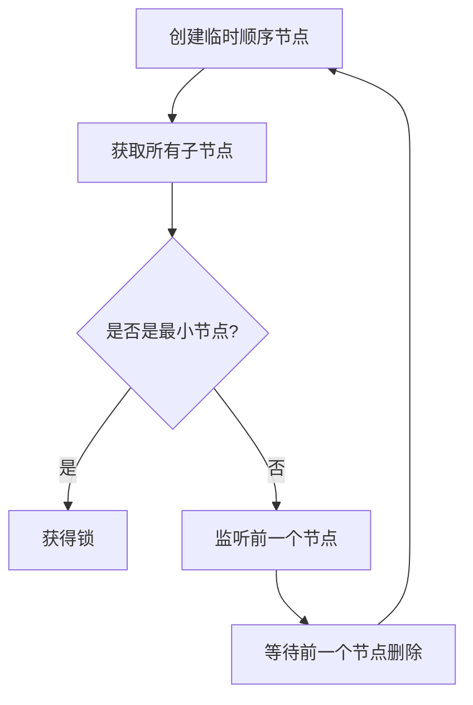

**ZK vs Redis**：

| 特性 | Redis | ZooKeeper |
|-----|-------|-----------|
| **性能** | 高（内存操作） | 较低（磁盘+Leader选举） |
| **可靠性** | 主从切换可能丢失 | ZAB协议保证一致 |
| **获取锁** | 客户端轮询 | Watcher机制通知 |
| **实现方式** | SET NX EX | 临时顺序节点 |

### 6.2 分布式事务

**Q37: 分布式事务的解决方案有哪些？**

**参考答案**：

**1. 2PC（两阶段提交）**
- **缺点**：同步阻塞、单点故障、数据不一致

**2. 3PC（三阶段提交）**
- 改进：增加CanCommit阶段，超时机制
- **缺点**：仍然存在数据不一致

**3. TCC（Try-Confirm-Cancel）**
- **优点**：性能好、最终一致
- **缺点**：代码侵入、需实现三个接口

**4. 本地消息表**
```java
// 发送消息
@Transactional
public void sendOrder(Order order) {
    // 1. 业务操作
    orderMapper.insert(order);

    // 2. 保存本地消息
    Message message = new Message();
    message.setPayload(order);
    message.setStatus("PENDING");
    messageMapper.insert(message);

    // 3. 定时任务扫描消息表，发送到MQ
}

// 消费消息
@Transactional
public void consume(Message message) {
    // 1. 幂等性检查
    if (isProcessed(message.getId())) {
        return;
    }

    // 2. 执行业务
    // 3. 标记消息已处理
}
```

**5. MQ事务消息**
```java
// RocketMQ事务消息
TransactionMQProducer producer = new TransactionMQProducer();
producer.setTransactionListener(new TransactionListener() {
    @Override
    public LocalTransactionState executeLocalTransaction(Message msg, Object arg) {
        try {
            // 执行本地事务
            orderService.createOrder(order);
            return LocalTransactionState.COMMIT_MESSAGE;
        } catch (Exception e) {
            return LocalTransactionState.ROLLBACK_MESSAGE;
        }
    }

    @Override
    public LocalTransactionState checkLocalTransaction(MessageExt msg) {
        // 回查事务状态
        return orderService.checkOrder(msg.getKeys()) ?
            LocalTransactionState.COMMIT_MESSAGE :
            LocalTransactionState.ROLLBACK_MESSAGE;
    }
});
```

**6. Saga模式**
```java
// 订单流程
Saga saga = Saga.builder()
    .chapter("扣减库存").invoke(inventoryService::deduct)
                      .compensate(inventoryService::addBack)
    .chapter("创建订单").invoke(orderService::create)
                      .compensate(orderService::cancel)
    .chapter("扣减余额").invoke(accountService::deduct)
                      .compensate(accountService::refund)
    .build();
```

### 6.3 分布式ID

**Q38: 分布式ID生成方案对比？**

**参考答案**：

| 方案 | 优点 | 缺点 | 适用场景 |
|-----|------|------|---------|
| **UUID** | 简单、无序 | 无序、太长、非数值 | 非主键场景 |
| **数据库自增** | 单调递增 | 分库分表困难 | 单库单表 |
| **Redis incr** | 性能高 | Redis单点 | 并发要求高 |
| **Snowflake** | 有序、高性能 | 时钟回拨问题 | 分布式场景 |
| **美团Leaf** | 高可用、无单点 | 需要ZK | 大厂方案 |

**Snowflake算法**：
```java
public class SnowflakeIdWorker {
    private final long workerId;
    private final long datacenterId;
    private long sequence = 0;
    private long lastTimestamp = -1L;

    // 0 - 0000000000 0000000000 0000000000 0000000000 0 - 00000 - 00000 - 000000000000
    public synchronized long nextId() {
        long timestamp = timeGen();

        // 时钟回拨处理
        if (timestamp < lastTimestamp) {
            throw new RuntimeException("时钟回拨");
        }

        if (lastTimestamp == timestamp) {
            sequence = (sequence + 1) & 0xFFF;
            if (sequence == 0) {
                timestamp = tilNextMillis(lastTimestamp);
            }
        } else {
            sequence = 0;
        }

        lastTimestamp = timestamp;

        return ((timestamp - 1288834974657L) << 22) |
               (datacenterId << 17) |
               (workerId << 12) |
               sequence;
    }
}
```

**ID结构**：1位符号位 + 41位时间戳 + 5位数据中心 + 5位机器ID + 12位序列号

### 6.4 CAP理论与BASE理论

**Q39: 如何理解CAP和BASE理论？**

**参考答案**：

**CAP理论**：
- **Consistency（一致性）**：所有节点数据一致
- **Availability（可用性）**：每个请求都能得到响应
- **Partition Tolerance（分区容错性）**：系统在网络分区时仍能运行

**不可能三角**：只能同时满足两个

| 组合 | 适用场景 | 代表系统 |
|-----|---------|---------|
| **CA** | 单机系统 | 单机数据库 |
| **CP** | 强一致场景 | ZooKeeper、HBase |
| **AP** | 高可用场景 | Cassandra、CouchDB |

**BASE理论**：
- **Basically Available（基本可用）**：允许损失部分可用性
- **Soft State（软状态）**：允许数据中间状态
- **Eventually Consistent（最终一致性）**：数据最终一致

**应用**：
```java
// 秒杀场景：先扣减Redis，再异步同步到DB
// 基本可用：Redis秒级响应
// 最终一致：MQ异步同步DB
public void seckill(Long productId, Long userId) {
    // 1. 扣减Redis库存
    Long stock = redisTemplate.opsForValue().decrement("stock:" + productId);
    if (stock < 0) {
        throw new BusinessException("库存不足");
    }

    // 2. 发送MQ消息，异步扣减DB
    mqProducer.send(new SeckillMessage(productId, userId));

    // 3. 返回成功（数据可能还未同步到DB，但最终一致）
}
```

---

## 🗄️ 七、数据库优化（25题）

### 7.1 索引优化

**Q40: MySQL索引的数据结构为什么选择B+树？**

**参考答案**：

**B+树特点**：
1. **非叶子节点只存键**：能存更多索引项，树更矮胖
2. **叶子节点存数据**：范围查询效率高
3. **叶子节点链表**：支持顺序扫描

**B+树 vs B树 vs Hash**：

| 特性 | B+树 | B树 | Hash |
|-----|------|-----|------|
| **范围查询** | ✅ 好 | ⚠️ 一般 | ❌ 不支持 |
| **点查询** | ✅ 好 | ✅ 好 | ✅ 最好 |
| **IO次数** | 少 | 较多 | - |
| **存储引擎** | InnoDB | MyISAM | Memory |

**Q41: 什么情况下索引会失效？**

**参考答案**：

```sql
-- 1. 使用函数，索引失效
SELECT * FROM user WHERE YEAR(create_time) = 2024;

-- 2. 隐式类型转换，索引失效
SELECT * FROM user WHERE phone = 13800138000;  -- phone是VARCHAR

-- 3. LIKE以%开头，索引失效
SELECT * FROM user WHERE name LIKE '%张%';

-- 4. OR连接未索引字段
SELECT * FROM user WHERE age = 20 OR name = '张三';

-- 5. 不符合最左前缀原则
-- 索引：(name, age, phone)
SELECT * FROM user WHERE age = 20;  -- 索引失效
```

**最左前缀原则**：
```sql
-- 联合索引 (name, age, phone)
-- ✅ 使用索引
SELECT * FROM user WHERE name = '张三';
SELECT * FROM user WHERE name = '张三' AND age = 20;

-- ❌ 不使用索引
SELECT * FROM user WHERE age = 20;
SELECT * FROM user WHERE phone = '13800138000';
```

### 7.2 事务隔离级别

**Q42: MySQL事务隔离级别及对应的问题？**

**参考答案**：

| 隔离级别 | 脏读 | 不可重复读 | 幻读 | 锁类型 |
|---------|------|-----------|------|-------|
| **读未提交** | ✅ 可能 | ✅ 可能 | ✅ 可能 | 无锁 |
| **读已提交** | ❌ 不可能 | ✅ 可能 | ✅ 可能 | MVCC |
| **可重复读** | ❌ 不可能 | ❌ 不可能 | ✅ 可能 | MVCC + Next-Key Lock |
| **串行化** | ❌ 不可能 | ❌ 不可能 | ❌ 不可能 | 表锁 |

**MySQL默认**：REPEATABLE READ（可重复读）

**Q43: MVCC（多版本并发控制）原理？**

**参考答案**：

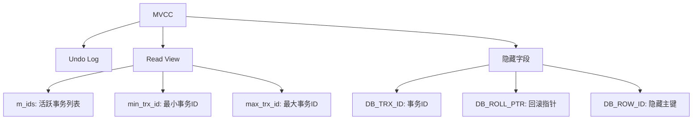

**版本链**：
```
记录1（事务100） → undo log → 记录2（事务90） → undo log → 记录3（事务80）
```

**Read View匹配规则**：
1. `DB_TRX_ID < min_trx_id`：可见（版本已提交）
2. `DB_TRX_ID > max_trx_id`：不可见（版本未来）
3. `min_trx_id <= DB_TRX_ID <= max_trx_id`：
   - 在`m_ids`中：不可见
   - 不在`m_ids`中：可见

### 7.3 锁机制

**Q44: MySQL的锁类型？**

**参考答案**：

**按锁粒度**：
- **全局锁**：锁定整个数据库
- **表级锁**：表锁、MDL（元数据锁）
- **行级锁**：Record Lock、Gap Lock、Next-Key Lock

**按锁类型**：
- **共享锁（S锁）**：读锁，多个S锁兼容
- **排他锁（X锁）**：写锁，与其他锁都不兼容

**按锁模式**：
- **Record Lock**：锁索引记录
- **Gap Lock**：锁间隙（防止幻读）
- **Next-Key Lock**：Record Lock + Gap Lock

```sql
-- 共享锁
SELECT * FROM user WHERE id = 1 LOCK IN SHARE MODE;

-- 排他锁
SELECT * FROM user WHERE id = 1 FOR UPDATE;

-- Next-Key Lock（RR级别默认）
SELECT * FROM user WHERE id > 10 FOR UPDATE;
-- 锁定：(10, +∞)
```

**Q45: 如何优化慢查询？**

**参考答案**：

**步骤**：

1. **开启慢查询日志**
```sql
SET GLOBAL slow_query_log = ON;
SET GLOBAL long_query_time = 1;  -- 超过1秒记录
```

2. **使用EXPLAIN分析**
```sql
EXPLAIN SELECT * FROM user WHERE name = '张三';

-- 关键指标：
-- type: 访问类型（ALL < index < range < ref < eq_ref < const）
-- rows: 扫描行数
-- Extra: Using index（索引覆盖）、Using filesort（文件排序）
```

3. **优化策略**
- **添加索引**：覆盖WHERE、ORDER BY、GROUP BY字段
- **避免SELECT \***：只查询需要的字段
- **分页优化**：延迟关联
```sql
-- ❌ 不好
SELECT * FROM user LIMIT 1000000, 10;

-- ✅ 好
SELECT * FROM user u
INNER JOIN (SELECT id FROM user LIMIT 1000000, 10) t
ON u.id = t.id;
```

---

## 📦 八、Redis缓存（22题）

### 8.1 数据类型

**Q46: Redis的5种基本数据类型及应用场景？**

**参考答案**：

| 类型 | 底层实现 | 应用场景 |
|-----|---------|---------|
| **String** | SDS | 缓存、计数器、分布式锁 |
| **Hash** | 哈希表 + 压缩列表 | 对象存储（如用户信息） |
| **List** | 双向链表 + 压缩列表 | 消息队列、关注列表 |
| **Set** | 哈希表 + 整数集合 | 标签、共同关注 |
| **ZSet** | 跳表 + 哈希表 | 排行榜、延迟队列 |

**示例**：
```java
// String: 计数器
redisTemplate.opsForValue().increment("view_count:article:123");

// Hash: 用户信息
redisTemplate.opsForHash().put("user:123", "name", "张三");
redisTemplate.opsForHash().put("user:123", "age", "20");

// List: 消息队列（LPUSH + BRPOP）
redisTemplate.opsForList().leftPush("mq:order", orderJson);

// Set: 共同关注
redisTemplate.opsForSet().intersect("user:123:follower", "user:456:follower");

// ZSet: 排行榜
redisTemplate.opsForZSet().add("rank:score", "user:123", 99.5);
redisTemplate.opsForZSet().reverseRangeWithScores("rank:score", 0, 9);
```

### 8.2 持久化

**Q47: RDB和AOF的区别？**

**参考答案**：

| 特性 | RDB | AOF |
|-----|-----|-----|
| **持久化方式** | 定时快照 | 记录写命令 |
| **文件大小** | 小（压缩） | 大（追加） |
| **恢复速度** | 快 | 慢 |
| **数据完整性** | 可能丢失数据 | 完整（根据刷盘策略） |
| **性能影响** | fork子进程 | 取决于刷盘频率 |

**RDB配置**：
```bash
# 900秒内至少1个key变化则保存
save 900 1
save 300 10
save 60 10000
```

**AOF配置**：
```bash
appendonly yes
appendfsync everysec  # 每秒刷盘
```

**混合持久化（Redis 4.0+）**：
```bash
aof-use-rdb-preamble yes  # RDB做基础，AOF做增量
```

### 8.3 缓存问题

**Q48: 缓存穿透、击穿、雪崩的解决方案？**

**参考答案**：

**1. 缓存穿透（查询不存在的数据）**

```java
// 方案1：布隆过滤器
BloomFilter<String> filter = BloomFilter.create(
    Funnels.stringFunnel(Charset.defaultCharset()),
    1000000,
    0.01
);
// 初始化时将所有key放入过滤器

public User getUser(Long id) {
    if (!filter.mightContain(String.valueOf(id))) {
        return null;  // 直接返回，不查DB
    }
    // 查询缓存和DB
}

// 方案2：缓存空对象
public User getUser(Long id) {
    User user = redisTemplate.opsForValue().get("user:" + id);
    if (user != null) {
        return user.equals("") ? null : user;
    }

    user = userMapper.selectById(id);
    if (user == null) {
        // 缓存空对象，设置较短过期时间
        redisTemplate.opsForValue().set("user:" + id, "", 5, TimeUnit.MINUTES);
        return null;
    }

    redisTemplate.opsForValue().set("user:" + id, user, 30, TimeUnit.MINUTES);
    return user;
}
```

**2. 缓存击穿（热点key过期）**

```java
// 方案1：互斥锁（Redis SET NX）
public User getUser(Long id) {
    User user = redisTemplate.opsForValue().get("user:" + id);
    if (user != null) {
        return user;
    }

    String lockKey = "lock:user:" + id;
    try {
        // 尝试获取锁
        Boolean locked = redisTemplate.opsForValue()
            .setIfAbsent(lockKey, "1", 10, TimeUnit.SECONDS);
        if (Boolean.TRUE.equals(locked)) {
            // 双重检查
            user = redisTemplate.opsForValue().get("user:" + id);
            if (user != null) {
                return user;
            }

            // 查询DB
            user = userMapper.selectById(id);
            redisTemplate.opsForValue().set("user:" + id, user, 30, TimeUnit.MINUTES);
            return user;
        } else {
            // 未获取锁，短暂等待后重试
            Thread.sleep(100);
            return getUser(id);
        }
    } catch (Exception e) {
        // 异常处理
    } finally {
        redisTemplate.delete(lockKey);
    }
}

// 方案2：逻辑过期（不设置TTL，字段中存过期时间）
```

**3. 缓存雪崩（大量key同时过期）**

```java
// 方案1：随机过期时间
int expireTime = 30 + new Random().nextInt(10);  // 30-40分钟
redisTemplate.opsForValue().set("user:" + id, user, expireTime, TimeUnit.MINUTES);

// 方案2：缓存预热（系统启动时加载热点数据）
@PostConstruct
public void init() {
    List<User> hotUsers = userMapper.selectHotUsers();
    hotUsers.forEach(user -> {
        redisTemplate.opsForValue().set("user:" + user.getId(), user, 1, TimeUnit.HOURS);
    });
}

// 方案3：限流降级
@SentinelResource(value = "getUser", blockHandler = "handleBlock")
public User getUser(Long id) { ... }
```

### 8.4 集群模式

**Q49: Redis主从、哨兵、集群模式的区别？**

**参考答案**：

| 模式 | 特点 | 优点 | 缺点 | 适用场景 |
|-----|------|------|------|---------|
| **主从复制** | 1主N从，读写分离 | 读性能提升 | 主节点故障需手动切换 | 读多写少 |
| **哨兵模式** | 主从 + 哨兵监控 | 自动故障转移 | 哨兵可能单点 | 高可用 |
| **集群模式** | 16384个槽位 | 自动分片、高可用 | 节点通信开销 | 大数据量 |

**集群槽位分配**：
```bash
# 节点分配
节点0: 槽位 0-5460
节点1: 槽位 5461-10922
节点2: 槽位 10923-16383

# 计算公式
槽位 = CRC16(key) % 16384

# HashTag: 保证相关key在同一节点
SET user:123:name "张三"
SET user:123:age "20"
# 使用{}内的部分计算hash
SET user:{123}:name "张三"
SET user:{123}:age "20"
```

---

## 📨 九、消息队列（18题）

### 9.1 消息丢失

**Q50: 如何保证消息不丢失？**

**参考答案**：

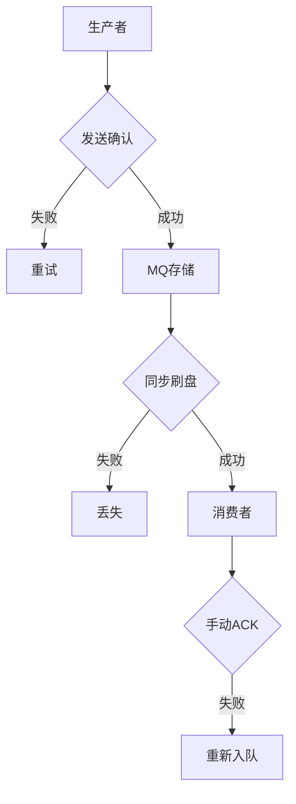

**三个阶段保证**：

**1. 生产者阶段**：
```java
// RabbitMQ: 开启确认模式
rabbitTemplate.setConfirmCallback((correlationData, ack, cause) -> {
    if (!ack) {
        // 发送失败，记录日志或重试
        log.error("消息发送失败：{}", cause);
    }
});

// Kafka: 开启ack=all
properties.put(ProducerConfig.ACKS_CONFIG, "all");
properties.put(ProducerConfig.RETRIES_CONFIG, 3);
```

**2. MQ阶段**：
```bash
# RabbitMQ: 持久化
queue.declare(queue_name, true, false, false, null)  # 队列持久化
basic_publish("", queue_name, MessageProperties.PERSISTENT_TEXT_PLAIN, message)  # 消息持久化

# Kafka: 副本数>=2, min.insync.replicas>=2
log.retention.hours=168
log.segment.bytes=1073741824
```

**3. 消费者阶段**：
```java
// RabbitMQ: 手动ACK
@RabbitListener(queues = "order_queue")
public void consume(Message message, Channel channel) throws IOException {
    try {
        Order order = JSON.parseObject(new String(message.getBody()), Order.class);
        orderService.process(order);
        channel.basicAck(message.getMessageProperties().getDeliveryTag(), false);
    } catch (Exception e) {
        // 拒绝并重新入队
        channel.basicNack(message.getMessageProperties().getDeliveryTag(), false, true);
    }
}
```

### 9.2 消息顺序性

**Q51: 如何保证消息顺序？**

**参考答案**：

**问题场景**：
- 多个生产者、多个分区、多个消费者
- 消息乱序

**解决方案**：

**1. 单分区 + 单消费者**
```java
// Kafka: 发送时指定分区
ProducerRecord<String, String> record = new ProducerRecord<>(
    "order_topic",
    0,  // 固定分区
    orderId,
    orderJson
);
```

**2. Hash分区**
```java
// 根据业务key（如订单ID）计算分区
int partition = Math.abs(orderId.hashCode()) % partitionCount;
ProducerRecord<String, String> record = new ProducerRecord<>(
    "order_topic",
    partition,
    orderId,
    orderJson
);
```

**3. 消费者单线程**
```java
@KafkaListener(topics = "order_topic", concurrency = "1")
public void consume(ConsumerRecord<String, String> record) {
    // 单线程消费，保证顺序
    Order order = JSON.parseObject(record.value(), Order.class);
    orderService.process(order);
}
```

### 9.3 消息积压

**Q52: 消息积压如何处理？**

**参考答案**：

**临时方案**：
```java
// 1. 增加消费者（前提：队列足够分区）
@KafkaListener(topics = "order_topic", concurrency = "10")  // 增加到10个消费者
public void consume(ConsumerRecord<String, String> record) { }

// 2. 临时消费者（只消费不处理，快速清空队列）
@KafkaListener(topics = "order_topic", containerFactory = "batchFactory")
public void batchConsume(List<ConsumerRecord<String, String>> records) {
    // 批量保存到临时存储（如Redis、临时表）
    redisTemplate.opsForList().rightPushAll("temp:order", records);
}

// 3. 后台线程慢慢处理临时存储的数据
```

**长期方案**：
- 优化消费逻辑
- 增加消费者数量
- 增加队列分区数
- 提升消费者性能

### 9.4 重复消费

**Q53: 如何实现幂等性？**

**参考答案**：

**1. 数据库唯一索引**
```sql
CREATE UNIQUE INDEX uk_order_no ON order(order_no);
-- 重复插入会报DuplicateKeyException
```

**2. Redis分布式锁**
```java
public void processOrder(Order order) {
    String lockKey = "lock:order:" + order.getOrderNo();
    Boolean locked = redisTemplate.opsForValue()
        .setIfAbsent(lockKey, "1", 10, TimeUnit.MINUTES);

    if (!Boolean.TRUE.equals(locked)) {
        log.info("订单正在处理中：{}", order.getOrderNo());
        return;
    }

    try {
        // 处理订单
        orderService.create(order);
    } finally {
        redisTemplate.delete(lockKey);
    }
}
```

**3. 状态机判断**
```java
public void payOrder(Long orderId) {
    Order order = orderMapper.selectById(orderId);
    if (order.getStatus() != OrderStatus.UNPAID) {
        log.info("订单已支付：{}", orderId);
        return;
    }

    order.setStatus(OrderStatus.PAID);
    orderMapper.updateById(order);
}
```

**4. Token机制**
```java
// 生产者生成token
String token = UUID.randomUUID().toString();
message.setHeader("token", token);
rabbitTemplate.send(message);

// 消费者检查token
String token = message.getMessageProperties().getHeader("token");
Boolean exists = redisTemplate.opsForValue().setIfAbsent("token:" + token, "1", 10, TimeUnit.MINUTES);
if (!Boolean.TRUE.equals(exists)) {
    log.info("重复消费：{}", token);
    return;
}
```

---

## 🏗️ 十、系统设计（20题）

### 10.1 秒杀系统

**Q54: 如何设计一个秒杀系统？**

**参考答案**：

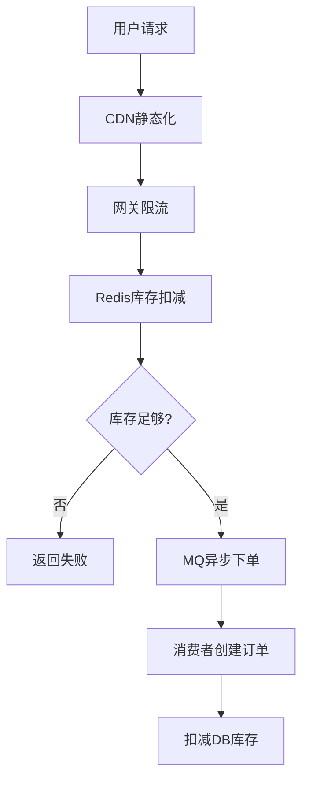

**核心优化**：

**1. 页面静态化**
```html
<!-- 秒杀页面提前生成，部署到CDN -->
<!DOCTYPE html>
<html>
<head>
    <title>秒杀活动</title>
</head>
<body>
    <h1>iPhone 15 Pro 秒杀</h1>
    <p>价格：¥7999</p>
    <p>库存：<span id="stock">1000</span></p>
    <button onclick="seckill()">立即抢购</button>
</body>
</html>
```

**2. 网关限流**
```yaml
spring:
  cloud:
    gateway:
      routes:
        - id: seckill
          uri: lb://seckill-service
          predicates:
            - Path=/api/seckill/**
          filters:
            - name: RequestRateLimiter
              args:
                redis-rate-limiter.replenishRate: 100  # 每秒补充100个令牌
                redis-rate-limiter.burstCapacity: 200  # 桶容量200
```

**3. Redis库存扣减（Lua保证原子性）**
```lua
-- seckill.lua
local stock = redis.call('get', KEYS[1])
if tonumber(stock) <= 0 then
    return 0  -- 库存不足
end

redis.call('decr', KEYS[1])
redis.call('sadd', KEYS[2], ARGV[1])  -- 记录已抢购用户
return 1  -- 抢购成功
```

```java
public boolean seckill(Long userId, Long productId) {
    String lua = "seckill.lua";
    DefaultRedisScript<Long> script = new DefaultRedisScript<>(lua, Long.class);

    Long result = redisTemplate.execute(
        script,
        Arrays.asList("stock:" + productId, "user:" + productId + ":" + userId),
        String.valueOf(userId)
    );

    if (result == 1) {
        // 发送MQ消息，异步创建订单
        mqProducer.send(new SeckillMessage(userId, productId));
        return true;
    }
    return false;
}
```

**4. MQ异步下单**
```java
@RabbitListener(queues = "seckill_order_queue")
public void createOrder(SeckillMessage message) {
    // 创建订单
    Order order = new Order();
    order.setUserId(message.getUserId());
    order.setProductId(message.getProductId());
    order.setStatus(OrderStatus.CREATED);
    orderMapper.insert(order);

    // 扣减DB库存
    int rows = productMapper.deductStock(message.getProductId());
    if (rows == 0) {
        // 库存不足，取消订单
        order.setStatus(OrderStatus.CANCELLED);
        orderMapper.updateById(order);
    }
}
```

**5. 防刷策略**
- 验证码：防止机器刷单
- 限流：单用户限制请求频率
- 黑名单：IP限制、设备指纹
- 预热：提前加载库存到Redis

### 10.2 高并发系统

**Q55: 高并发系统如何设计？**

**参考答案**：

```
┌─────────────────────────────────────────────┐
│                   CDN                        │  静态资源
└─────────────────────────────────────────────┘
                    ↓
┌─────────────────────────────────────────────┐
│              负载均衡（LVS/Nginx）             │
└─────────────────────────────────────────────┘
                    ↓
┌─────────────────────────────────────────────┐
│            API网关（限流、熔断、鉴权）          │
└─────────────────────────────────────────────┘
                    ↓
┌───────────────┬───────────────┬───────────────┐
│   服务A       │   服务B       │   服务C       │
├───────────────┼───────────────┼───────────────┤
│ Redis缓存     │ Redis缓存     │ Redis缓存     │
│ 消息队列      │ 消息队列      │ 消息队列      │
└───────────────┴───────────────┴───────────────┘
                    ↓
┌─────────────────────────────────────────────┐
│          数据库（读写分离、分库分表）          │
└─────────────────────────────────────────────┘
```

**优化策略**：

**1. 无状态服务**
```java
// 用户状态存Redis，不存Session
@RestController
public class UserController {
    @GetMapping("/user/info")
    public User getUserInfo(@RequestHeader("Authorization") String token) {
        Long userId = JwtUtil.parseToken(token);
        return redisTemplate.opsForValue().get("user:" + userId);
    }
}
```

**2. 异步处理**
```java
// 同步：串行执行，耗时长
public void register(User user) {
    userService.save(user);          // 100ms
    emailService.send(user);         // 500ms
    smsService.send(user);           // 300ms
}
// 总耗时：900ms

// 异步：并行执行，耗时短
@Async
public void register(User user) {
    userService.save(user);          // 100ms
    emailService.sendAsync(user);    // 异步
    smsService.sendAsync(user);      // 异步
}
// 总耗时：100ms
```

**3. 缓存策略**
```java
// 多级缓存
@Cacheable(value = "user", key = "#id")
public User getUser(Long id) {
    // L1: 本地缓存（Caffeine）
    // L2: Redis缓存
    // L3: 数据库
    return userMapper.selectById(id);
}

// 缓存预热
@PostConstruct
public void init() {
    List<User> hotUsers = userMapper.selectHotUsers();
    hotUsers.forEach(user -> {
        caffeineCache.put(user.getId(), user);
        redisTemplate.opsForValue().set("user:" + user.getId(), user, 30, TimeUnit.MINUTES);
    });
}
```

**4. 数据库优化**
```java
// 读写分离
@DS("master")  // 主库
public void createOrder(Order order) {
    orderMapper.insert(order);
}

@DS("slave")   // 从库
public Order getOrder(Long orderId) {
    return orderMapper.selectById(orderId);
}

// 分库分表（ShardingSphere）
# sharding-jdbc配置
spring:
  shardingsphere:
    datasource:
      names: ds0,ds1
      ds0:
        jdbc-url: jdbc:mysql://localhost:3306/db0
      ds1:
        jdbc-url: jdbc:mysql://localhost:3306/db1
    sharding:
      tables:
        t_order:
          actual-data-nodes: ds$->{0..1}.t_order_$->{0..1}
          database-strategy:
            inline:
              sharding-column: user_id
              algorithm-expression: ds$->{user_id % 2}
          table-strategy:
            inline:
              sharding-column: order_id
              algorithm-expression: t_order_$->{order_id % 2}
```

**5. 限流降级**
```java
// Sentinel限流
@SentinelResource(
    value = "orderService",
    blockHandler = "handleBlock",
    fallback = "handleFallback"
)
public Order createOrder(Order order) {
    return orderService.save(order);
}

// 限流处理
public Order handleBlock(Order order, BlockException e) {
    log.warn("限流了：{}", e.getClass().getSimpleName());
    throw new BusinessException("系统繁忙，请稍后重试");
}

// 降级处理
public Order handleFallback(Order order, Throwable e) {
    log.error("异常了：{}", e.getMessage());
    // 返回默认值或缓存数据
    return Order.getDefault();
}
```

### 10.3 分布式配置中心

**Q56: Nacos、Apollo、Spring Cloud Config对比？**

**参考答案**：

| 特性 | Nacos | Apollo | Spring Cloud Config |
|-----|-------|--------|---------------------|
| **开源社区** | 阿里 | 网易携程 | Spring |
| **配置存储** | 内存/数据库 | 数据库 | Git/DB |
| **动态刷新** | ✅ 支持 | ✅ 支持 | ✅ 需配合Bus |
| **灰度发布** | ✅ 支持 | ✅ 支持 | ❌ 不支持 |
| **权限管理** | ✅ 支持 | ✅ 支持 | 依赖Git |
| **多环境** | ✅ Namespace | ✅ Cluster | ✅ Profile |
| **服务注册** | ✅ 集成 | ❌ 需额外组件 | ❌ 需Eureka/Consul |
| **部署复杂度** | 简单 | 中等 | 简单 |

**推荐**：新项目推荐Nacos（注册+配置二合一）

### 10.4 链路追踪

**Q57: Skywalking、Zipkin、Pinpoint对比？**

**参考答案**：

| 特性 | Skywalking | Zipkin | Pinpoint |
|-----|-----------|--------|----------|
| **实现方式** | ByteBuddy（字节码注入） | 字节码注入 | Agent字节码增强 |
| **性能损耗** | 低（<5%） | 中等 | 中等 |
| **代码侵入** | 无 | 无 | 无 |
| **存储** | ES/MySQL/H2 | ES/Cassandra | HBase |
| **UI友好度** | ⭐⭐⭐⭐⭐ | ⭐⭐⭐ | ⭐⭐⭐⭐ |
| **社区活跃度** | 高（Apache） | 高（Twitter） | 中等（韩国） |

**Skywalking使用**：
```bash
# Agent配置
-agentpath:/path/to/skywalking-agent.jar=
  agent.service_name=order-service
  agent.collector.backend_service=127.0.0.1:11800
  agent.logging.level=INFO
```

---

## 📚 推荐学习资源

### 官方文档
- [Java 21 官方文档](https://docs.oracle.com/en/java/javase/21/)
- [Spring Boot 3.2 文档](https://docs.spring.io/spring-boot/docs/current/reference/html/)
- [Spring Cloud Alibaba 文档](https://sca.aliyun.com/)
- [MySQL 8.0 参考手册](https://dev.mysql.com/doc/refman/8.0/en/)
- [Redis 官方文档](https://redis.io/docs/)

### 面试题资源
- [2025年大厂Java面试题，热门高频200题+答案汇总](https://blog.csdn.net/x1ao_fe1/article/details/149976915)
- [2024年最新阿里Java高级岗200+面试题](https://developer.aliyun.com/article/1401077)
- [Java后端面试必考场景题大全（2025实战版）](https://blog.csdn.net/2501_91139003/article/details/148095690)
- [2025 Java高级面试指南](https://blog.csdn.net/mxt51220/article/details/148519025)
- [字节、腾讯、京东等一线大厂高频面试真题合集](https://blog.csdn.net/2401_89213290/article/details/145252890)

### 开源项目
- [mall-swarm：微服务电商系统](https://github.com/macrozheng/mall-swarm)
- [mall4cloud：B2B2C商城系统](https://github.com/gz-yami/mall4cloud)

---

**祝你面试成功！** 🎉

**文档版本**：v2.0（2026年2月）| **作者**：小徐
